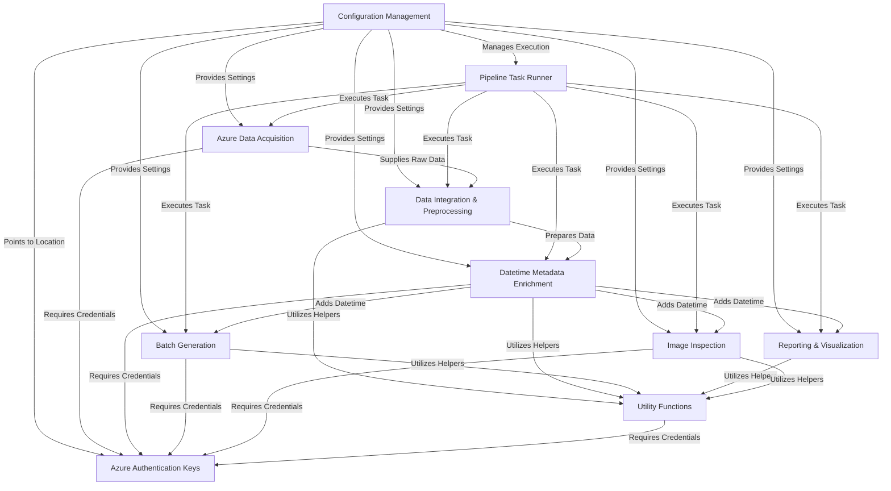

# Tutorial: Field-DataExploration

This project automates the processing and exploration of *field image data*.
It starts by **acquiring raw lists and metadata** from *Azure cloud storage*.
This data is then **integrated, cleaned, and enriched** with crucial *datetime information*,
often extracted directly from images. The processed data is organized into
**manageable batches** and used to generate **comprehensive reports and visualizations**
for analysis. The entire workflow is directed by a **centralized configuration system**.

**Source Repository:** [None](None)

## Chapters

1. [Configuration Management
](docs/01_configuration_management_.md)
2. [Pipeline Task Runner
](docs/02_pipeline_task_runner_.md)
3. [Azure Data Acquisition
](docs/03_azure_data_acquisition_.md)
4. [Data Integration & Preprocessing
](docs/04_data_integration___preprocessing_.md)
5. [Datetime Metadata Enrichment
](docs/05_datetime_metadata_enrichment_.md)
6. [Reporting & Visualization
](docs/06_reporting___visualization_.md)
7. [Batch Generation
](docs/07_batch_generation_.md)
8. [Image Inspection
](docs/08_image_inspection_.md)
9. [Utility Functions
](docs/09_utility_functions_.md)
10. [Azure Authentication Keys
](docs/10_azure_authentication_keys_.md)

---

Generated by [AI Codebase Knowledge Builder](https://github.com/The-Pocket/Tutorial-Codebase-Knowledge)