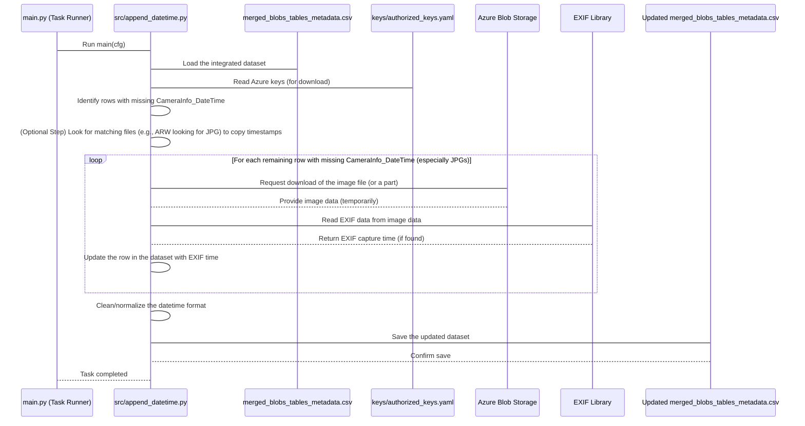

# Chapter 5: Datetime Metadata Enrichment

Welcome back! In the previous chapter, [Chapter 4: Data Integration & Preprocessing](04_data_integration___preprocessing_.md), we successfully combined all the raw data we acquired from Azure into one organized dataset, saved as `merged_blobs_tables_metadata.csv`. This dataset contains lots of useful information about each image file and its associated metadata.

However, there's one piece of information that's absolutely *crucial* for many analyses, especially those related to time (like tracking changes over seasons or comparing data from different collection dates), that might still be missing or incorrect: the exact **date and time the image was captured by the camera**. In our project, this is often stored in a column called `CameraInfo_DateTime`.

### What is Datetime Metadata Enrichment?

Imagine you have a box full of old printed photos. Some might have the date written on the back, but many might not. If you want to know when a specific photo was taken, you might have to look closely at the photo itself – maybe there's a clock in the background, or a calendar, or the weather looks like a specific time of year you remember.

For digital photos, there's a similar hidden trick! Most digital cameras automatically embed information about when and where the photo was taken directly *inside* the image file itself. This hidden data is called **EXIF data**.

**Datetime Metadata Enrichment** is the process of reading this EXIF data from the image files to find the original capture date and time, and then adding this information to our main dataset (`merged_blobs_tables_metadata.csv`), especially for rows where the `CameraInfo_DateTime` is missing or blank. It's like finding that hidden date *on* the digital photo file itself and writing it onto your organized list.

**The Central Use Case:** Our main goal in this step is to ensure that as many rows as possible in our `merged_blobs_tables_metadata.csv` file have an accurate `CameraInfo_DateTime`, preferably extracted from the image's EXIF data if it's not already present from other sources. This correct timestamp is essential for all downstream reporting and analysis that relies on knowing *when* an image was taken.

### Why is this important?

*   **Temporal Analysis:** To see how plant growth changes over the season, or how detection rates vary by month, you *must* know the capture date/time.
*   **Reporting Accuracy:** Reports often group data by date or time period. Without correct timestamps, these groupings would be wrong.
*   **Data Completeness:** A dataset with missing key information like capture time is incomplete and less valuable.

### How to Use Datetime Metadata Enrichment

As with the other steps, you control this process through the project's configuration. The task responsible for this is called `append_datetime`.

To run the datetime enrichment, you need to include `append_datetime` in the `pipeline` list within your `conf/config.yaml` file. Since this task needs the integrated data file (`merged_blobs_tables_metadata.csv`) produced in the previous step, it must come *after* `process_tables_analysis`.

Here's how your `conf/config.yaml` might look to include this step:

```yaml
# conf/config.yaml (Snippet showing Datetime Enrichment task)

# ... other settings ...

pipeline:
    - wir_table_generator     # Acquire Table data (from Ch 3)
    - wir_blob_data_generator # Acquire Blob metrics (from Ch 3)
    - process_blob_analysis   # Merge Blob metrics and image references (from Ch 4)
    - process_tables_analysis # Merge with other tables and clean/structure (from Ch 4)
    - append_datetime         # Now, enrich with CameraInfo_DateTime

# ... other settings ...
```

When you run `python main.py` with this configuration, the [Pipeline Task Runner](02_pipeline_task_runner_.md) will execute the tasks in order. After the data is integrated, the `append_datetime` task will run. Its code will read the `merged_blobs_tables_metadata.csv`, check for missing `CameraInfo_DateTime` values, attempt to fill them using EXIF data, and save the updated CSV file.

### How It Works Under the Hood

The `append_datetime` task involves a few steps to fill in the missing timestamps. It primarily relies on reading the EXIF data embedded in image files, but it might also use other strategies if possible.

Here's a simplified flow of what happens when the `append_datetime` task runs:



This diagram shows that the task loads the data, finds rows needing attention, and then for specific image types (like JPGs), it might reach back out to Azure, download the image data temporarily, read its hidden EXIF timestamp, and use that to update the dataset.

Let's look at simplified snippets from the code in `src/append_datetime.py` and related helper functions in `utils/utils.py`.

#### The Main Logic (`src/append_datetime.py`)

The `main` function orchestrates the steps:

```python
# src/append_datetime.py (Simplified main function)
import logging
from omegaconf import DictConfig # Hydra's config type
# ... other imports ...

log = logging.getLogger(__name__) # Setup logging

class EXIFMetadataManager:
    def __init__(self, cfg: DictConfig):
        # Load configuration, input CSV, and keys
        self.cfg = cfg
        # Find the most recent merged_blobs_tables_metadata.csv
        self.csv_path = Path(find_most_recent_data_csv(Path(cfg.paths.datadir, "processed_tables"), "merged_blobs_tables_metadata.csv"))
        self.df = read_csv_as_df(self.csv_path) # Read the CSV into a pandas DataFrame
        self.keys = read_yaml(cfg.pipeline_keys) # Read Azure keys for download
        # Get Azure Blob details from keys
        self.sas_token = self.keys["blobs"]["weedsimagerepo"]["sas_token"]
        self.wir_url = self.keys["blobs"]["weedsimagerepo"]["url"]

    def load_and_prepare_dataframe(self) -> pd.DataFrame:
        """Loads the main data and prepares it for processing."""
        # This method loads the main CSV and might do some initial prep
        # (like adding 'Stem' and 'Extension' columns needed later)
        # The full version also handles merging with historical 'permanent' data
        # but we'll simplify here.
        
        # Ensure 'Stem' and 'Extension' exist based on 'Name' column
        self.df['Stem'] = self.df['Name'].str.replace(r'\.(jpg|arw)$', '', case=False, regex=True)
        self.df['Extension'] = self.df['Name'].str.extract(r'\.(jpg|arw|JPG|ARW)$', flags=re.IGNORECASE)[0].str.lower()

        return self.df # Return the DataFrame ready for updates

    def update_missing_camera_info(self, df: pd.DataFrame) -> pd.DataFrame:
        """Orchestrates filling missing timestamps."""
        log.info("Attempting to fill missing CameraInfo_DateTime...")
        helper = CameraInfoHelper(df) # Create a helper object

        # First, try to fill using matching files (e.g., ARW from JPG)
        df_filled_by_stem = helper.fill_missing_by_stem()
        helper.df = df_filled_by_stem # Update the helper's internal DataFrame

        # Next, try downloading and reading EXIF for remaining missing JPGs
        df_updated_from_exif = helper.update_with_downloaded_exif(
            sas_token=self.sas_token, wir_url=self.wir_url
        )

        # Finally, normalize any dates found into a consistent format
        df_updated_from_exif['CameraInfo_DateTime'] = normalize_datetime_column(
            df_updated_from_exif['CameraInfo_DateTime']
        )
        
        # The code also attempts to derive a 'BatchID' here if it's missing
        # based on the newly found CameraInfo_DateTime. (Simplified)

        return df_updated_from_exif # Return the fully updated DataFrame

    def save_updated_dataframes(self, df: pd.DataFrame) -> None:
        """Saves the modified DataFrame."""
        # Save the updated DataFrame back to the original CSV path
        df.to_csv(self.csv_path, index=False)
        log.info(f"Saved updated data to {self.csv_path}")

def main(cfg: DictConfig) -> None:
    # This is the entry point called by the Task Runner (from Chapter 2)
    log.info("Starting CameraInfo_DateTime update pipeline.")
    manager = EXIFMetadataManager(cfg) # Create the manager object, passing config
    df_prepared = manager.load_and_prepare_dataframe() # Load and prep data
    df_updated = manager.update_missing_camera_info(df_prepared) # Perform the update steps
    manager.save_updated_dataframes(df_updated) # Save the result
    log.info("CameraInfo_DateTime update pipeline completed.")

# If you run this file directly (not via main.py), it will execute main()
if __name__ == "__main__":
    main()
```

**Explanation:**

*   The `main(cfg)` function is the starting point, receiving the full configuration (`cfg`) object.
*   It creates an `EXIFMetadataManager` object, passing `cfg`.
*   The `__init__` method of the manager reads the `merged_blobs_tables_metadata.csv` file (using `find_most_recent_data_csv` to locate it and `read_csv_as_df` to read it into a pandas DataFrame) and the Azure keys file (`cfg.pipeline_keys`).
*   `load_and_prepare_dataframe` does some initial setup on the DataFrame, ensuring columns like `Stem` and `Extension` are available.
*   `update_missing_camera_info` is where the core logic of filling missing dates happens. It uses a helper class (`CameraInfoHelper`) to perform the actual updates.
*   `save_updated_dataframes` simply saves the final DataFrame, with the newly added or corrected datetimes, back to the same CSV file, overwriting the previous version.

#### Helper for Updates (`CameraInfoHelper` in `src/append_datetime.py`)

This class contains the specific methods for filling missing dates:

```python
# src/append_datetime.py (Simplified CameraInfoHelper class)
import logging
import pandas as pd
# ... other imports ...
from utils.utils import download_azcopy, get_exif_data, normalize_datetime_column # Helper functions

log = logging.getLogger(__name__)

class CameraInfoHelper:
    def __init__(self, df: pd.DataFrame):
        self.df = df.copy() # Work on a copy to avoid modifying original unexpectedly

    def fill_missing_by_stem(self) -> pd.DataFrame:
        """Fills missing CameraInfo_DateTime for ARWs using matching JPGs by stem."""
        log.info("Attempting to fill missing datetimes using matching JPGs...")
        # Find JPGs that *have* CameraInfo_DateTime
        jpg_lookup = self.df[
            self.df['CameraInfo_DateTime'].notna() & (self.df['Extension'] == 'jpg')
        ][['Stem', 'CameraInfo_DateTime']].drop_duplicates() # Get their Stem and DateTime

        # Merge this lookup table back onto the main DataFrame
        df_updated = self.df.merge(
            jpg_lookup, on='Stem', how='left', suffixes=('', '_jpg') # Merge based on 'Stem'
        )
        # Fill missing CameraInfo_DateTime using the '_jpg' column from the merge
        df_updated['CameraInfo_DateTime'] = df_updated['CameraInfo_DateTime'].fillna(df_updated['CameraInfo_DateTime_jpg'])

        log.info("Fill by stem completed.")
        return df_updated.drop(columns=['CameraInfo_DateTime_jpg']) # Clean up the temp column


    def update_with_downloaded_exif(self, sas_token: str, wir_url: str) -> pd.DataFrame:
        """Update rows with missing CameraInfo_DateTime by downloading EXIF info."""
        log.info("Attempting to fill remaining missing JPG datetimes via EXIF download...")

        # Find JPG rows that still have missing CameraInfo_DateTime *after* the stem fill
        missing_rows = self.df[
            (self.df['Extension'] == 'jpg') & (self.df['CameraInfo_DateTime'].isna())
        ]

        if missing_rows.empty:
            log.info("No JPGs found with missing CameraInfo_DateTime for EXIF download.")
            return self.df # Nothing to do

        log.info(f"Found {len(missing_rows)} JPGs needing EXIF download.")

        # This section would loop through 'missing_rows', download each image,
        # extract EXIF, and update the DataFrame. It uses threading for speed.
        # --- Simplified Download and Extraction Loop ---
        for index, row in missing_rows.iterrows():
            try:
                img_url_with_sas = row["ImageURL"] + sas_token # Full URL for download
                # Temporarily download the image file using azcopy helper
                with tempfile.NamedTemporaryFile(suffix=".jpg", delete=False) as tmp_file:
                     # Simplified: In reality, it calls utils.download_azcopy
                     pass # download_azcopy(img_url_with_sas, tmp_file.name)
                
                # Extract EXIF data from the temporary file using helper
                # Simplified: In reality, it calls utils.get_exif_data
                exif = {} # exif = get_exif_data(tmp_file.name) 
                
                # Clean up the temporary file
                # os.remove(tmp_file.name)

                exif_dt = exif.get("EXIF DateTimeOriginal") # Get the specific tag for capture time

                if exif_dt:
                    # Update the DataFrame if EXIF time was found
                    self.df.loc[index, "CameraInfo_DateTime"] = exif_dt
                    log.debug(f"Updated {row['Name']} with EXIF datetime: {exif_dt}")

            except Exception as e:
                log.warning(f"EXIF extraction failed for {row['Name']}: {e}")
        # --- End Simplified Loop ---

        log.info("EXIF download and update completed.")
        return self.df # Return the updated DataFrame

```

**Explanation:**

*   The `CameraInfoHelper` class is initialized with the DataFrame from the `EXIFMetadataManager`.
*   `fill_missing_by_stem` is a clever step. Sometimes, you have both a raw image file (like `.ARW`) and a corresponding `.JPG` file taken at the same time. The `.JPG` often has EXIF data even if the `.ARW` doesn't. This method finds pairs of files with the same "stem" name (e.g., `IMG_1234.ARW` and `IMG_1234.JPG`) and copies the `CameraInfo_DateTime` from the `.JPG` to the `.ARW` if the `.ARW` is missing it.
*   `update_with_downloaded_exif` handles the primary method: downloading the image data from Azure for rows (specifically JPGs) where `CameraInfo_DateTime` is still missing. It then uses helper functions (`download_azcopy` and `get_exif_data`) to get the image file and extract the EXIF data. If the "EXIF DateTimeOriginal" tag is found, it updates the DataFrame for that specific row.

#### Utility Functions (`utils/utils.py`)

The process relies on a couple of utility functions:

```python
# utils/utils.py (Simplified Snippets)
import exifread # Library to read EXIF data
import pandas as pd
from datetime import datetime
import re
# ... other imports ...

def get_exif_data(image_path: str) -> dict:
    """Extracts EXIF data from an image file and returns it as a dictionary."""
    # Opens the image file, uses the exifread library to parse it,
    # and returns a dictionary of EXIF tags and their values.
    # Handles potential errors and filters out large/unnecessary tags.
    try:
        with open(image_path, "rb") as f:
            tags = exifread.process_file(f)
        # Simplify the returned data structure
        if tags:
             # Example: return only key EXIF tags
             return {k: str(v) for k, v in tags.items() if k in ["EXIF DateTimeOriginal", "Image Make", "Image Model"]}
        return {}
    except Exception:
        # Handle errors during EXIF reading
        return {}


def download_azcopy(azuresrc: str, localdest: str):
    """Downloads a single file from Azure Blob Storage using the azcopy command-line tool."""
    # This function runs the 'azcopy cp' command in the background
    # to download the file specified by 'azuresrc' (which includes the SAS token)
    # to the 'localdest' path (the temporary file).
    # print(f"Simulating download from {azuresrc} to {localdest}")
    pass # Simplified - the actual function runs a subprocess command

def normalize_datetime_column(series: pd.Series) -> pd.Series:
    """
    Normalizes a datetime column that might contain inconsistent formats.
    Converts EXIF format (YYYY:MM:DD HH:MM:SS) to standard ISO format (YYYY-MM-DD HH:MM:SS)
    and converts to actual datetime objects.
    """
    # Replace colons in the date part with hyphens
    series = series.astype(str)
    series = series.str.replace(r"^(\d{4}):(\d{2}):(\d{2})", r"\1-\2-\3", regex=True)
    # Convert the cleaned string to a datetime object. 'errors='coerce' will turn
    # anything it can't parse into a missing value (NaT - Not a Time).
    return pd.to_datetime(series, errors='coerce')
```

**Explanation:**

*   `get_exif_data`: This function uses an external library (`exifread`) to open an image file and pull out the embedded EXIF metadata. It specifically looks for tags like "EXIF DateTimeOriginal".
*   `download_azcopy`: This function leverages the `azcopy` command-line tool (which needs to be installed separately and accessible) to download a file from Azure Blob Storage using its URL and SAS token. The `append_datetime` task uses this to temporarily grab the image file data.
*   `normalize_datetime_column`: EXIF data often uses a `YYYY:MM:DD` format instead of the standard `YYYY-MM-DD`. This utility function takes a column of dates, replaces the colons with hyphens in the date part, and then converts the whole column into proper datetime objects that pandas can work with easily.

By combining these steps – loading the data, attempting to fill from matching files, downloading images to read EXIF data where needed, and normalizing the format – the `append_datetime` task significantly improves the completeness and accuracy of the `CameraInfo_DateTime` column in the main dataset.

After this task runs, the `merged_blobs_tables_metadata.csv` file will have many more rows populated with the correct image capture time.

### Summary

In this chapter, we focused on **Datetime Metadata Enrichment**. We learned that this is the process of adding or correcting the `CameraInfo_DateTime` column in our integrated dataset by extracting the image capture time from the hidden **EXIF data** within the image files themselves, especially for rows where this information is missing.

We saw that this is managed by including the `append_datetime` task in the `pipeline` list in `conf/config.yaml`, ensuring it runs *after* the data integration step.

Under the hood, the `append_datetime` task (implemented in `src/append_datetime.py`) loads the integrated data, attempts to fill missing timestamps using helper methods (like finding matching JPGs for ARWs), and crucially, downloads image data from Azure where necessary to read the EXIF "DateTimeOriginal" tag. Utility functions from `utils/utils.py` (`get_exif_data`, `download_azcopy`, `normalize_datetime_column`) assist in reading the EXIF data, temporarily downloading files, and standardizing the datetime format.

The result is a much richer dataset with more accurate capture times, which is essential for the next steps in the pipeline.

Now that our main dataset has been enriched with accurate timestamps, we are ready to use this information to generate reports and visualizations!

Let's move on to the next chapter where we'll explore **Reporting & Visualization**.

[Reporting & Visualization](06_reporting___visualization_.md)

---

Generated by [AI Codebase Knowledge Builder](https://github.com/The-Pocket/Tutorial-Codebase-Knowledge)