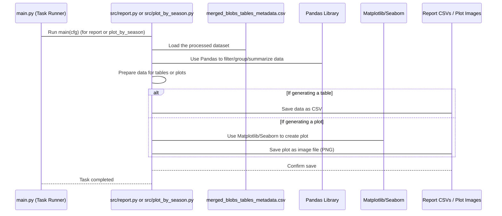

# Chapter 6: Reporting & Visualization

Welcome back! In our journey through the `Field-DataExploration` project, we've learned how to manage settings ([Chapter 1: Configuration Management](01_configuration_management_.md)), run different steps ([Chapter 2: Pipeline Task Runner](02_pipeline_task_runner_.md)), acquire raw data from Azure ([Chapter 3: Azure Data Acquisition](03_azure_data_acquisition_.md)), integrate and clean it ([Chapter 4: Data Integration & Preprocessing](04_data_integration___preprocessing_.md)), and even enrich it with accurate timestamps from images ([Chapter 5: Datetime Metadata Enrichment](05_datetime_metadata_enrichment_.md)).

Now that we have a cleaned-up, organized, and timestamped dataset (`merged_blobs_tables_metadata.csv`), it's time to make sense of it all! A huge table full of rows and columns is great for computers to process, but not so easy for humans to understand at a glance. This is where **Reporting & Visualization** comes in.

### What is Reporting & Visualization?

Imagine you've collected all the clues for your detective case (that's the processed data!). Now you need to present your findings to your boss. You wouldn't just give them a giant stack of every single clue. Instead, you'd:

1.  **Summarize (Reporting):** Create bullet points, summary tables, or key statistics highlighting the most important facts (e.g., "We found 15 suspects," "Most clues were found near the park," "The average time of incidents was late afternoon"). This is like creating summary tables or statistics from your data.
2.  **Show Visually (Visualization):** Draw charts or graphs to make trends easy to spot (e.g., a bar chart showing the number of incidents per month, or a map showing where clues were found). This is like creating plots, graphs, or dashboards from your data.

**Reporting & Visualization** is the process of taking the final, processed dataset and generating these kinds of summaries, tables, and various plots (graphs and charts). These outputs help you:

*   **Visualize trends:** See how data changes over time (e.g., uploads per week).
*   **Understand distributions:** See how data is spread across categories (e.g., number of samples per species or state).
*   **Track project progress:** See how much data has been collected or processed.
*   **Identify issues:** Spot anomalies or unexpected patterns in the data quality.

**The Central Use Case:** The goal is to generate useful reports and visual summaries from the integrated and enriched data. For instance, you might want to see how many images were uploaded last week, how many samples of each plant species have been collected so far, or compare the number of raw images to JPGs collected in different states. This chapter explains how the project does this automatically.

### Key Concepts

To turn our data table into useful reports and plots, the project uses a few standard tools and techniques:

1.  **Data Grouping and Aggregation:** To create summaries, we often need to group data by categories (like 'State' or 'Species') and then count or sum things within those groups. The `pandas` library in Python is excellent at this.
2.  **Table Generation:** Once we have summarized data (like counts per category), we can present it as a neatly formatted table, usually saved as a CSV file for easy sharing or further use.
3.  **Plotting Libraries:** To create graphs and charts, the project uses popular Python libraries like `matplotlib` and `seaborn`. These libraries take the processed data (often still in a pandas DataFrame) and turn it into visual representations like bar charts, line graphs, etc.
4.  **Configuration for Output:** Just like input data paths are configured ([Chapter 1: Configuration Management](01_configuration_management_.md)), the directories where reports and plots should be saved are also specified in the configuration (`cfg.paths`).

### How to Use Reporting & Visualization

You don't directly interact with the code that generates reports and plots. Instead, you tell the [Pipeline Task Runner](02_pipeline_task_runner_.md) to run these steps by including the relevant task names in the `pipeline` list within your `conf/config.yaml` file.

The main tasks responsible for reporting and visualization are:

*   `report`: This task generates various summary tables (as CSVs) and some plots covering general data statistics and potential preprocessing issues.
*   `plot_by_season`: This task focuses specifically on generating plots related to data collection volume, often grouped by species, state, and "season" (derived from the capture date).

To ensure reports and visualizations are generated when you run the project, make sure these tasks are listed in your `pipeline` *after* the data acquisition, integration, and enrichment tasks ([Chapter 3](03_azure_data_acquisition_.md), [Chapter 4](04_data_integration___preprocessing_.md), [Chapter 5](05_datetime_metadata_enrichment_.md)). They need the `merged_blobs_tables_metadata.csv` file as input.

Here's an example of how your `conf/config.yaml` might look to run the full pipeline including reporting:

```yaml
# conf/config.yaml (Snippet showing Reporting & Visualization tasks)

# ... acquisition, integration, enrichment tasks from previous chapters ...
pipeline:
    - wir_table_generator
    - wir_blob_data_generator
    - process_blob_analysis
    - process_tables_analysis
    - append_datetime         # Data is now integrated & enriched
    - report                  # Generate general reports & plots
    - plot_by_season          # Generate season-specific plots
    # - image_inspection      # Next task...

# ... other settings ...
```

When you run `python main.py` with this configuration, the [Pipeline Task Runner](02_pipeline_task_runner_.md) will execute `append_datetime`, then `report`, and then `plot_by_season` in that order. The `report` and `plot_by_season` tasks will read the latest version of `merged_blobs_tables_metadata.csv` (updated by `append_datetime`) and generate their output files in the directories specified in your configuration.

### How It Works Under the Hood

Let's see the simplified process when you trigger the `report` or `plot_by_season` tasks:



As you can see, the Task Runner simply calls the specific code responsible for the task (`src/report.py` or `src/plot_by_season.py`). This task code then uses the `cfg` object (which contains *all* the configuration, including the paths to the input data and where to save outputs), reads the `merged_blobs_tables_metadata.csv` file, uses `pandas` to manipulate the data into the required format, uses `matplotlib` and `seaborn` to create visualizations, and finally saves the results as files (CSV or image) in the directories specified by `cfg.paths`.

Let's look at simplified snippets from the actual files responsible:

#### Generating Reports and Plots (`src/report.py`)

This file contains classes and functions to generate various summary tables and plots, often related to data processing status or overall data volume.

```python
# src/report.py (Simplified Snippet)
import logging
import pandas as pd
from pathlib import Path
from datetime import datetime, timedelta
import seaborn as sns # For plotting
import matplotlib.pyplot as plt # For plotting
from omegaconf import DictConfig

from utils.utils import find_most_recent_data_csv # Helper

log = logging.getLogger(__name__)

class BatchReport:
    """A class to generate reports for Field data visualization."""

    def __init__(self, cfg: DictConfig) -> None:
        """Initialize BatchReport, load data, configure directories."""
        self.cfg = cfg
        # Find the most recent integrated CSV
        self.csv_path = find_most_recent_data_csv(cfg.paths.datadir, "merged_blobs_tables_metadata.csv")
        self.df = self.read() # Load the data
        self.config_report_dir() # Set up output directories
        self.num_past_days_for_report = cfg.inspection.num_past_days_for_report # Get setting from config

    def read(self) -> pd.DataFrame:
        """Read and load data from the main CSV file."""
        log.info(f"Reading data from: {self.csv_path}")
        # Read the CSV into a pandas DataFrame
        df = pd.read_csv(self.csv_path, low_memory=False)
        # Ensure datetime column is in correct format
        df["UploadDateTimeUTC"] = pd.to_datetime(df["UploadDateTimeUTC"], errors='coerce')
        return df

    def config_report_dir(self) -> None:
        """Configure and create necessary directories for report outputs."""
        # Get report directory from config and create it if it doesn't exist
        self.report_dir = Path(self.cfg.paths.reportdir)
        self.report_dir.mkdir(exist_ok=True, parents=True)

        # Get plots directory from config and create it
        self.plots_all_years = Path(self.cfg.paths.plots_all_years)
        self.plots_all_years.mkdir(exist_ok=True, parents=True)
        log.info(f"Report directory: {self.report_dir}")
        log.info(f"Plots directory: {self.plots_all_years}")


    def num_uploads_selected_days_by_state(self):
        """Creates a table of uploads from last selected days by location."""
        log.info("Generating uploads table for last few days...")
        df = self.df.copy()
        
        # Calculate the date range based on the config setting
        current_date = pd.to_datetime(datetime.now().date())
        selected_days_ago = current_date - timedelta(self.num_past_days_for_report)

        # Filter the DataFrame for data within the date range
        df_recent = df[
            (df["UploadDateTimeUTC"].dt.date >= selected_days_ago.date())
            & (df["UploadDateTimeUTC"].dt.date <= current_date.date())
        ].copy()

        # Group data by State, PlantType, Species, Extension, etc. and count
        grouped_df = (
            df_recent.groupby(
                [
                    "UsState",
                    "PlantType",
                    "Species",
                    "Extension",
                    "HasMatchingJpgAndRaw",
                ]
            )
            .size() # Count rows in each group
            .reset_index(name="count") # Turn the grouped count into a column
        )

        # Define the save path using the timestamped report directory from config
        file_name = f"uploads_last_{self.num_past_days_for_report}_days_by_state.csv"
        # Note: cfg.paths.reportdir_timestamp is configured to include the current date/time
        file_save_path = Path(self.cfg.paths.reportdir_timestamp, file_name)
        
        # Ensure the timestamped directory exists
        file_save_path.parent.mkdir(exist_ok=True, parents=True)
        
        grouped_df.to_csv(file_save_path, index=False) # Save as CSV
        log.info(f"Created table of uploads from last {self.num_past_days_for_report} days: {file_save_path}")

    def plot_image_vs_raws_by_species(self):
        """Generate a bar plot showing image counts by state and extension."""
        log.info("Generating image counts plot by state and extension...")

        # Group data by State and Extension and count unique names
        unique_ids_count = (
            self.df.groupby(["UsState", "Extension"])["Name"].nunique().reset_index()
        )

        # Plotting using seaborn
        with plt.style.context("ggplot"): # Use a nice plot style
            fig, ax = plt.subplots(figsize=(12, 6)) # Create a figure and axes

            sns.barplot( # Create the bar plot
                data=unique_ids_count,
                x="UsState",
                y="Name", # Use 'Name' which is the count here
                hue="Extension", # Separate bars by Extension (jpg/arw)
                ax=ax,
            )
            
            # Add titles and labels
            ax.set_xticklabels(ax.get_xticklabels(), rotation=45) # Rotate labels for readability
            ax.set_title("Number of Images by State and by Image Extension")
            ax.set_ylabel("Number of Images")
            ax.set_xlabel("State Location")
            ax.legend(title="Image Type")
            
            fig.tight_layout() # Adjust layout to prevent labels overlapping

            # Define the save path using the plots directory from config
            save_path = Path(self.cfg.paths.plots_all_years, "image_vs_raws_by_species.png")
            fig.savefig(save_path, dpi=300) # Save the figure as a PNG image
            plt.close(fig) # Close the figure to free memory
            log.info(f"Image vs Raws plot saved: {save_path}")


def main(cfg: DictConfig) -> None:
    """Main function to execute batch report tasks."""
    log.info(f"Starting task: {cfg.general.task}") # Log the task name
    
    # Create an instance of the report generator, passing the config
    batchrep = BatchReport(cfg)
    
    # Call methods to generate specific outputs
    # batchrep.write_missing_raws(batchrep.df) # Example of another report
    batchrep.num_uploads_selected_days_by_state() # Generate the recent uploads table
    batchrep.plot_image_vs_raws_by_species() # Generate the image type distribution plot
    # ... other report/plot methods are called here ...

    # The PreprocessingCheck class in report.py generates separate reports
    # related to the status of local data folders.
    analyzer = PreprocessingCheck(cfg) # Create instance for preprocessing checks
    analysis_results_df = analyzer.analyze_directory() # Run analysis on local folders
    analyzer.plot_batches_per_week(analysis_results_df) # Plot results
    analyzer.save_to_csv(analysis_results_df) # Save analysis results to CSV
    
    log.info(f"Task {cfg.general.task} completed.")

```

**Explanation:**

*   The `main(cfg)` function is the entry point called by the [Pipeline Task Runner](02_pipeline_task_runner_.md). It receives the full `cfg` object.
*   It creates a `BatchReport` object, passing `cfg`.
*   The `__init__` method of `BatchReport` loads the `merged_blobs_tables_metadata.csv` file into a pandas DataFrame (`self.df`) using the `find_most_recent_data_csv` helper (to make sure it gets the latest version from the timestamped processed data directory) and `pd.read_csv`. It also sets up the output directories specified in `cfg.paths` and gets the number of recent days for reporting from `cfg.inspection`.
*   The `num_uploads_selected_days_by_state` method shows how pandas is used to filter the DataFrame for recent dates, group the data by different categories (`UsState`, `PlantType`, etc.), count the number of rows in each group, and save the result as a new CSV file in a timestamped report directory.
*   The `plot_image_vs_raws_by_species` method shows how pandas is used to group data for plotting. It then uses `seaborn.barplot` to create a bar chart based on the grouped data and `fig.savefig` to save the resulting plot as a PNG image file in the configured plots directory. `matplotlib.pyplot` (imported as `plt`) is used for figure management (`fig, ax = plt.subplots(...)`) and saving (`fig.savefig`).
*   The `main` function also shows that `src/report.py` includes another class, `PreprocessingCheck`, which performs analysis on local storage directories and generates a separate report and plot about preprocessing activity (`plot_batches_per_week`).

#### Generating Plots by Season (`src/plot_by_season.py`)

This file contains specific logic and methods for generating plots that often involve the "Season" concept derived from the `CameraInfo_DateTime`.

```python
# src/plot_by_season.py (Simplified Snippet)
import logging
import pandas as pd
from pathlib import Path
from datetime import datetime
import seaborn as sns # For plotting
import matplotlib.pyplot as plt # For plotting
from omegaconf import DictConfig

from utils.utils import find_most_recent_data_csv # Helper

log = logging.getLogger(__name__)

class PlotsBySeason:
    """A class to generate plots of unique samples by season."""
    def __init__(self, cfg: DictConfig) -> None:
        """Initialize PlotsBySeason, load data, configure directories."""
        self.cfg = cfg
        # Find the most recent integrated CSV
        self.csv_path = find_most_recent_data_csv(cfg.paths.datadir, "merged_blobs_tables_metadata.csv")
        self.df = pd.read_csv(self.csv_path, low_memory=False) # Load the data

        # Ensure datetime column is in correct format
        self.df["CameraInfo_DateTime"] = pd.to_datetime(self.df["CameraInfo_DateTime"], errors='coerce')

        # Create directories for plots
        self.reportplot_dir = Path(cfg.paths.report_plots) # General plot directory
        self.reportplot_dir.mkdir(exist_ok=True, parents=True)

        self.plots_current_season = Path(cfg.paths.plots_current_season) # Directory for current season plots
        self.plots_current_season.mkdir(exist_ok=True, parents=True)
        log.info(f"Plot directories: {self.reportplot_dir}, {self.plots_current_season}")

    def add_season_column(self) -> pd.DataFrame:
        """Add a 'Season' column based on CameraInfo_DateTime and PlantType."""
        log.info("Adding 'Season' column to the data.")
        df_with_season = self.df.copy()

        # --- Simplified Logic for determining season ---
        # The actual code checks PlantType and date relative to Oct 1st
        # to assign season labels like "YYYY WEEDS" or "YYYY/YYYY+1 COVERCROPS"
        df_with_season['Season'] = df_with_season.apply(
            lambda row: f"{row['CameraInfo_DateTime'].year} {row['PlantType']}" if row['PlantType'] in ['WEEDS', 'CASHCROPS']
                      else (f"{row['CameraInfo_DateTime'].year - 1}/{row['CameraInfo_DateTime'].year} {row['PlantType']}" if row['CameraInfo_DateTime'].month < 10
                            else f"{row['CameraInfo_DateTime'].year}/{row['CameraInfo_DateTime'].year + 1} {row['PlantType']}"),
            axis=1 # Apply this logic row by row
        )
        # --- End Simplified Logic ---

        log.info("Season column added successfully.")
        return df_with_season


    def plot_unique_samples_species_current_season(self, data_current_season: pd.DataFrame) -> None:
        """Generate bar plot of unique samples by species for the current season."""
        log.info("Generating samples by species plot for current season.")

        # Filter data for current season and relevant images (e.g., those with raw + jpg pair)
        data = data_current_season[data_current_season["HasMatchingJpgAndRaw"] == True].copy()

        # Group by Species and count unique MasterRefIDs
        unique_ids_count = (
            data.groupby(["Species"])["MasterRefID"]
            .nunique()
            .reset_index(name="sample_count") # Name the count column
            .sort_values(by="sample_count") # Sort for plotting
        )

        # Plotting using matplotlib and seaborn
        with plt.style.context("ggplot"):
            fig, ax = plt.subplots(figsize=(12, 8))

            # Create the bar plot
            bars = sns.barplot(
                data=unique_ids_count,
                x="Species",
                y="sample_count",
                color="#C44E52", # Set bar color
                ax=ax,
            )

            # Add labels and title
            ax.set_xticklabels(ax.get_xticklabels(), rotation=90) # Rotate species names
            ax.set_ylabel("Number of Unique Samples")
            ax.set_xlabel("Species")
            ax.set_title(f"Samples by Species (Current Season)")

            # Add counts on top of bars
            for bar in bars.patches: # Iterate through the bars
                ax.text(
                    bar.get_x() + bar.get_width() / 2., # X position (center of bar)
                    bar.get_height(), # Y position (top of bar)
                    f"{bar.get_height():.0f}", # The text (the count)
                    ha="center", # Horizontal alignment
                    va="bottom" # Vertical alignment
                )

            fig.tight_layout() # Adjust layout

            # Define save path using the current season plots directory
            save_path = Path(self.cfg.paths.plots_current_season, "unique_masterrefids_by_species_current_season.png")
            fig.savefig(save_path, dpi=300) # Save the plot
            plt.close(fig) # Close the figure
            log.info(f"Species distribution plot saved for current season: {save_path}")


def main(cfg: DictConfig) -> None:
    """Main function to execute season-specific plotting tasks."""
    log.info(f"Starting task: {cfg.general.task}") # Log the task name

    # Create an instance of the plot generator, passing the config
    plots_season = PlotsBySeason(cfg)

    # Add the 'Season' column to the data
    data_with_season = plots_season.add_season_column()

    # Filter for current season data (simplified)
    # The actual code determines current seasons dynamically
    current_year = datetime.now().year
    current_season_labels = [
         f"{current_year - 1}/{current_year} COVERCROPS",
         f"{current_year} WEEDS",
         f"{current_year} CASHCROPS",
    ]
    data_current_season = data_with_season[data_with_season["Season"].isin(current_season_labels)]


    # Call methods to generate specific plots for the current season
    # plots_season.plot_unique_samples_state_plant_current_season(data_current_season) # Example plot
    plots_season.plot_unique_samples_species_current_season(data_current_season) # Generate the samples by species plot
    # plots_season.plot_image_vs_raws_by_species_current_season(data_current_season) # Example plot

    log.info(f"Task {cfg.general.task} completed.")
```

**Explanation:**

*   The `main(cfg)` function is the entry point, receiving the full `cfg` object.
*   It creates a `PlotsBySeason` object, passing `cfg`.
*   The `__init__` method of `PlotsBySeason` loads the `merged_blobs_tables_metadata.csv` into a pandas DataFrame (`self.df`) and ensures the `CameraInfo_DateTime` column is a proper datetime type. It also sets up the output directories from `cfg.paths`.
*   The `add_season_column` method is a key data preparation step. It uses the `CameraInfo_DateTime` and `PlantType` columns to calculate and add a new `Season` column to the DataFrame, grouping data logically by growing seasons.
*   `plot_unique_samples_species_current_season` takes the data (filtered for the current season), groups it by `Species`, counts the unique `MasterRefID`s (samples) in each group, and then uses `seaborn.barplot` to create a bar chart visualizing this distribution. It adds labels to the bars and saves the plot as a PNG image in the `plots_current_season` directory.

Both `src/report.py` and `src/plot_by_season.py` follow a similar pattern: they are activated by the [Pipeline Task Runner](02_pipeline_task_runner_.md), they load the processed data CSV, use `pandas` to manipulate and summarize the data, use `matplotlib`/`seaborn` to create visuals (for plotting tasks), and save their outputs (CSV tables or PNG images) to the directories specified in the configuration (`cfg.paths`).

After these tasks run, you will find several new CSV files (summary tables) and PNG files (plots) in the directories configured under `cfg.paths.reportdir_timestamp`, `cfg.paths.plots_all_years`, and `cfg.paths.plots_current_season`. These files provide valuable insights into the collected data.

### Summary

In this chapter, we explored **Reporting & Visualization**. We learned that this crucial step takes our integrated and enriched dataset and generates easy-to-understand summaries, tables, and plots to help us visualize trends, understand data distributions, and track project progress.

We saw that this is achieved by including the `report` and `plot_by_season` tasks in the `pipeline` list in `conf/config.yaml`, ensuring they run after the data is ready.

Under the hood, these tasks are implemented in `src/report.py` and `src/plot_by_season.py`. They load the `merged_blobs_tables_metadata.csv` file, use the powerful `pandas` library to group and summarize data, and leverage `matplotlib` and `seaborn` to create various types of plots. All generated tables (CSVs) and plots (PNG images) are saved to specific directories defined in the project's configuration (`cfg.paths`).

Now that we have generated reports and visualizations to understand our data, the next step in some workflows might be to prepare specific subsets of this data for further use, perhaps for training a machine learning model or for more detailed inspection.

Let's move on to the next chapter where we'll learn about **Batch Generation**.

[Batch Generation](07_batch_generation_.md)

---

Generated by [AI Codebase Knowledge Builder](https://github.com/The-Pocket/Tutorial-Codebase-Knowledge)