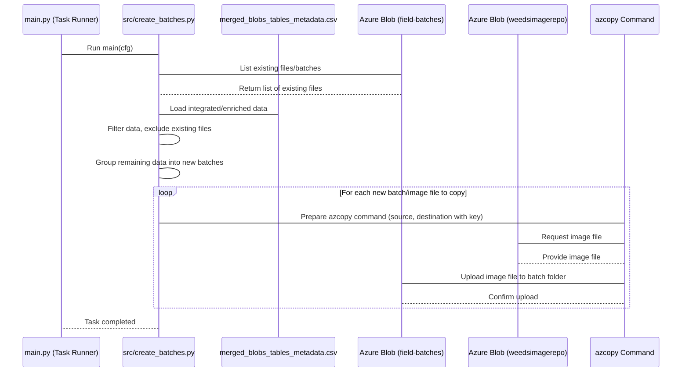

# Chapter 7: Batch Generation

Welcome back! In our previous chapters, we've covered how to set up the project's configuration ([Chapter 1: Configuration Management](01_configuration_management_.md)), run different pipeline steps automatically ([Chapter 2: Pipeline Task Runner](02_pipeline_task_runner_.md)), acquire raw data from Azure ([Chapter 3: Azure Data Acquisition](03_azure_data_acquisition_.md)), integrate and clean that data ([Chapter 4: Data Integration & Preprocessing](04_data_integration___preprocessing_.md)), and even make sure we have accurate capture times for each image ([Chapter 5: Datetime Metadata Enrichment](05_datetime_metadata_enrichment_.md)). Most recently, in [Chapter 6: Reporting & Visualization](06_reporting___visualization_.md), we learned how to generate summaries and plots from this processed data.

Now, we're going to look at a step that prepares specific subsets of our data and the associated image files for *further dedicated processing* or *human review*. This is the **Batch Generation** process.

### What is Batch Generation?

Imagine you have a massive library of books (that's all the processed data and images). You need to send some specific books to a special team for detailed analysis – maybe the books written last week, or only books about a certain topic from a particular author. You wouldn't send the whole library! Instead, you'd:

1.  **Identify:** Go through your main catalog (the `merged_blobs_tables_metadata.csv` file) to find the books that match your criteria (e.g., uploaded last week, matching specific metadata).
2.  **Group:** Put these selected books into logical groups or "batches" (like boxes labelled "Recent Uploads - Week 1").
3.  **Prepare:** Get those specific books ready. In our case, this involves identifying the *actual image files* associated with the selected records.
4.  **Move/Copy:** Transfer these specific books (the image files) to a dedicated location or storage area where the special team (another process or person) can easily access *only* this specific batch.

**Batch Generation** is the process of taking the processed image metadata (from `merged_blobs_tables_metadata.csv`), identifying specific images based on criteria (like location, date, or data quality flags), logically grouping them into "batches", and then copying the *corresponding raw image files* from their original Azure storage location to a *different* Azure storage location specifically organized by these new batch groups.

**The Central Use Case:** A common need in this project is to prepare subsets of raw images for subsequent steps like detailed visual inspection or feeding into a machine learning model. For example, you might want to review all images uploaded in the last 7 days that have metadata indicating a certain plant species. Batch Generation allows you to automatically select these images (based on the metadata), group them (e.g., by state and date), and make the *raw image files* easily accessible in a new, organized location, separate from the huge archive.

### Why do we need this?

*   **Organization:** It structures data into manageable chunks based on specific criteria, making it easier to work with.
*   **Targeted Processing:** Downstream processes (like image inspection interfaces or ML training scripts) can easily access only the specific batch they need, without sifting through the entire dataset.
*   **Efficiency:** It prevents reprocessing images that have already been batched for a specific purpose.
*   **Separation of Concerns:** It separates the main archive of raw data from subsets prepared for specific tasks.

### Key Concepts

*   **Processed Metadata:** The `merged_blobs_tables_metadata.csv` file is the source of truth for selecting images.
*   **Batching Criteria:** Images are grouped based on their metadata, typically including `UsState` and the `CameraInfo_DateTime` (date and time). The code specifically groups images captured around the same time (within 3-hour blocks on the same day and state).
*   **Source Blob:** The original Azure Blob Storage container where all raw images (`.ARW` files) are stored (e.g., `weedsimagerepo`).
*   **Destination Blob:** A different Azure Blob Storage container specifically for storing generated batches (e.g., `field-batches`).
*   **Avoiding Duplicates:** The process checks the destination blob to see which images (or batches) have already been copied, ensuring only *new* images meeting the criteria are added to new batches.
*   **`azcopy`:** A command-line tool used by the project to efficiently copy files between Azure Blob Storage locations.

### How to Use Batch Generation

As with other tasks, you control Batch Generation by including its name in the `pipeline` list in your `conf/config.yaml` file. The task name for this process is `create_batches`.

Since this task relies heavily on the enriched metadata (especially the `CameraInfo_DateTime` and data quality flags like `HasMatchingJpgAndRaw`), it must run *after* the data acquisition, integration, and enrichment steps ([Chapter 3](03_azure_data_acquisition_.md), [Chapter 4](04_data_integration___preprocessing_.md), [Chapter 5](05_datetime_metadata_enrichment_.md)).

Here's an example of how your `conf/config.yaml` might look to run the pipeline including batch generation:

```yaml
# conf/config.yaml (Snippet showing Batch Generation task)

# ... acquisition, integration, enrichment tasks from previous chapters ...
pipeline:
    - wir_table_generator
    - wir_blob_data_generator
    - process_blob_analysis
    - process_tables_analysis
    - append_datetime         # Data is integrated & enriched
    - report                  # Generate reports
    - plot_by_season          # Generate season-specific plots
    - create_batches          # Now, generate batches for inspection/other steps
    - image_inspection        # Next task (uses the generated batches)

# ... other settings ...
```

When you run `python main.py` with this configuration, the [Pipeline Task Runner](02_pipeline_task_runner_.md) will execute `create_batches` after the previous tasks. The code for `create_batches` will then read the latest `merged_blobs_tables_metadata.csv`, check the destination blob (`field-batches`), identify new images that should be batched, group them, and use `azcopy` to copy the corresponding `.ARW` files to the `field-batches` container under a new batch folder structure (like `US_2023-10-27/raws/01/image1.ARW`).

### How It Works Under the Hood

The `create_batches` task in `src/create_batches.py` orchestrates several steps:

1.  **Identify Existing Batches:** It first connects to the *destination* Azure Blob container (`field-batches`) and lists all the files already there. This tells it which images have already been batched.
2.  **Load and Filter Data:** It loads the latest `merged_blobs_tables_metadata.csv` (which was enriched with timestamps in [Chapter 5](05_datetime_metadata_enrichment_.md)). It filters this data to include only images that meet specific quality criteria (like having a matching JPG and ARW file) and have a valid capture time.
3.  **Exclude Already Batched Images:** It compares the list of images from step 1 (already batched) with the filtered data from step 2 (potential candidates) and keeps only the images that are *new* and haven't been batched yet.
4.  **Group into Batches:** For the remaining *new* images, it groups them based on `UsState`, the capture date, and rounded capture time (to the nearest 3 hours). This creates the logical batches.
5.  **Determine Destination Paths:** For each image in the new batches, it determines the specific folder path where the corresponding `.ARW` file should be copied in the destination blob (e.g., `STATE_YYYY-MM-DD/raws/HH/filename.ARW`).
6.  **Copy Image Files:** It then uses the `azcopy` command-line tool to copy the selected `.ARW` files from the original source blob (`weedsimagerepo`) to the newly determined paths in the destination blob (`field-batches`). This copying can be done concurrently (multiple files at once) for speed.

Here's a simplified sequence diagram:



Let's look at simplified snippets from the code in `src/create_batches.py`.

#### The Main Logic (`src/create_batches.py`)

The `main` function orchestrates the steps:

```python
# src/create_batches.py (Simplified main function)
import logging
from omegaconf import DictConfig
# ... other imports ...

log = logging.getLogger(__name__)

def main(cfg: DictConfig) -> None:
    """Main function to orchestrate the batch processing."""
    log.info(f"Starting {cfg.general.task}")

    # 1. Identify existing batches in the destination blob
    # Uses FieldBatchLister to connect to field-batches and get a list of files
    present_batches_df = FieldBatchLister(cfg).df
    # (Optional: Save this list for debugging)
    present_batches_df.to_csv("present_batches.csv", index=False)

    # 2. Set up the main processor and load/prepare the metadata
    dataproc = CreateBatchProcessor(cfg)
    dataproc.config_keys() # Get necessary Azure keys
    dataproc.split_datetime() # Extract date and time parts
    dataproc.preprocess_df() # Filter for quality criteria (HasMatchingJpgAndRaw, etc.)

    # 3. Group into batches based on criteria
    dataproc.adjust_groups() # Creates the 'batches' column with target paths

    # 4. Exclude images already present in destination batches
    dataproc.filter_batched_data(present_batches_df)

    # 5. Copy image files to the destination blob (using azcopy)
    run_concurrent = True # Setting to choose concurrent or sequential copy
    if run_concurrent:
        dataproc.process_df_concurrently() # Use multiple threads to copy
    else:
        dataproc.process_df() # Copy one by one

    log.info(f"Task '{cfg.general.task}' completed successfully.")
```

**Explanation:**

*   The `main(cfg)` function is the entry point, receiving the full configuration (`cfg`) object.
*   It first calls `FieldBatchLister(cfg).df` to get a list of all files already in the `field-batches` container.
*   Then, it creates a `CreateBatchProcessor` object, passing `cfg`. This processor handles loading the main `merged_blobs_tables_metadata.csv` and preparing it.
*   It calls the processor's methods (`split_datetime`, `preprocess_df`) to filter the metadata for relevant images and extract date/time components.
*   `dataproc.adjust_groups()` adds a new column (`batches`) to the DataFrame. This column contains the *full target path* in the destination blob where the corresponding `.ARW` file should be copied, based on state, date, and time grouping.
*   `dataproc.filter_batched_data()` removes any rows (images) from the DataFrame whose "base name" already exists in the `present_batches_df` list.
*   Finally, it calls either `process_df_concurrently` or `process_df` (depending on the `run_concurrent` setting) to perform the actual copying of files using `azcopy`.

#### Loading Existing Batches (`FieldBatchLister` in `src/create_batches.py`)

This class is used *before* processing the main metadata to get the list of files already in the destination blob (`field-batches`).

```python
# src/create_batches.py (Simplified FieldBatchLister class)
import logging
import pandas as pd
from azure.storage.blob import BlobServiceClient # Azure library
from omegaconf import DictConfig
from tqdm import tqdm # For progress bar

from utils.utils import read_yaml

log = logging.getLogger(__name__)

class FieldBatchLister:

    def __init__(self, cfg):
        """Initializes the lister to list files in the destination blob."""
        self.keys = read_yaml(cfg.pipeline_keys) # Read Azure keys
        self.container_name = "field-batches" # The destination container name
        self.field_batches_sas_token = self.keys["blobs"][self.container_name]["read_sas_token"] # Get token
        self.field_batches_url = self.keys["blobs"]["account_url"] # Get account URL

        # List all relevant blobs (files) in the container
        all_blobs = self.list_unique_folders()
        # Process the blob names to extract components like BaseName
        self.df = self.get_blobs_per_batch(all_blobs)
        log.info(f"Found {len(self.df)} images already in '{self.container_name}' blob container.")


    def list_unique_folders(self):
        """Lists all blob names (file paths) in the container."""
        blob_service_client = BlobServiceClient(account_url=self.field_batches_url, credential=self.field_batches_sas_token)
        container_client = blob_service_client.get_container_client(self.container_name)
        all_blobs = []
        # Iterate through all blobs in the container
        for blob in tqdm(container_client.list_blobs(), desc=f"Listing blobs in {self.container_name}"):
            # Keep only specific types of files, ignore temporary or preprocessed ones
            if ("raws" in blob.name) and not ("preprocessed" in blob.name):
                all_blobs.append(blob.name)
        return all_blobs

    def get_blobs_per_batch(self, all_blobs):
        """Parses blob names to extract base filename (without extension)."""
        df = pd.DataFrame(all_blobs, columns=['BlobName'])
        # Split the full path (BlobName) into components
        df[['BatchID', 'Subfolder1', 'Subfolder2', 'FileName']] = df['BlobName'].str.split('/',n=4, expand=True)
        # Extract the base name (filename without extension)
        df["BaseName"] = df["FileName"].str.rsplit(".", n=1).str[0]
        # Return a DataFrame primarily containing the BaseName
        return df[["BaseName", "BlobName"]]
```

**Explanation:**

*   `FieldBatchLister` connects to the specified Azure Blob container (`field-batches`) using credentials from `cfg.pipeline_keys`.
*   `list_unique_folders` uses the Azure Blob Storage client library (`azure.storage.blob`) to get a list of *every* blob name (file path) in the container. It filters this list to focus on relevant files.
*   `get_blobs_per_batch` takes this list of paths and uses pandas string manipulation to extract the base filename (like `IMG_1234` from `some/path/IMG_1234.ARW`).
*   The resulting DataFrame (`self.df`) contains the `BaseName` of every image already copied to the destination, which is used later to exclude duplicates.

#### Processing and Grouping Data (`CreateBatchProcessor` in `src/create_batches.py`)

This class contains the methods to load and filter the main metadata, group it into batches, and determine the target paths for copying.

```python
# src/create_batches.py (Simplified CreateBatchProcessor methods)
import logging
import pandas as pd
from datetime import datetime, timedelta
from pathlib import Path
import re
# ... other imports ...

from utils.utils import find_most_recent_csv, read_yaml # Helper functions

log = logging.getLogger(__name__)

class CreateBatchProcessor:
    """Processor for handling batch operations on images based on metadata."""
    def __init__(self, cfg: DictConfig) -> None:
        # Load configuration, input CSV, and keys
        self.cfg = cfg
        self.ykeys = read_yaml(cfg.pipeline_keys)
        # Find the most recent merged_blobs_tables_metadata.csv
        self.datadir = Path(cfg.paths.datadir, "processed_tables")
        self.csv_path = Path(find_most_recent_csv(self.datadir, "merged_blobs_tables_metadata.csv"))
        # Read the data, handling potential errors and date formats
        self.read_and_convert_datetime()
        log.info(f"Loaded data from {self.csv_path} with {len(self.df)} rows.")

    def read_and_convert_datetime(self) -> None:
        """Reads the main CSV and ensures CameraInfo_DateTime is a proper datetime."""
        # Read the CSV, specifying CameraInfo_DateTime as string initially
        self.df = pd.read_csv(self.csv_path, dtype={'CameraInfo_DateTime': str})
        # Use a helper function to standardize format and convert to datetime objects
        self.df["CameraInfo_DateTime"] = pd.to_datetime(self.df['CameraInfo_DateTime'], errors='coerce')
        # Handle cases where the primary CSV might be missing this column (fall back to permanent archive)
        if "CameraInfo_DateTime" not in self.df.columns or self.df['CameraInfo_DateTime'].isnull().all():
             log.warning("CameraInfo_DateTime column missing or empty, trying permanent archive.")
             permanent_csv = Path(self.cfg.paths.persistent_datadir,"merged_blobs_tables_metadata_permanent.csv")
             self.df = pd.read_csv(permanent_csv, dtype={'CameraInfo_DateTime': str})
             self.df["CameraInfo_DateTime"] = pd.to_datetime(self.df['CameraInfo_DateTime'], errors='coerce')


    def preprocess_df(self) -> "CreateBatchProcessor":
        """Filters the DataFrame based on required criteria."""
        log.info("Preprocessing DataFrame: Filtering for quality criteria...")
        # Keep only rows where HasMatchingJpgAndRaw is True
        self.df = self.df[self.df["HasMatchingJpgAndRaw"] == True].copy()
        # Keep only rows where UsState is not missing
        self.df = self.df.dropna(subset=["UsState"])
        # Keep only rows for JPG files (or ARW depending on what's being batched)
        self.df = self.df[self.df["Extension"] == "jpg"].copy() # Note: Batches are named after ARW but created from JPG metadata often
        # Keep only rows with a valid CameraInfo_DateTime
        self.df = self.df.dropna(subset=["CameraInfo_DateTime"])
        log.info(f"After preprocessing: {len(self.df)} rows remaining.")
        return self

    def adjust_groups(self) -> pd.DataFrame:
        """Groups data by State, Date, and Time (rounded to 3 hours) to create batch structure."""
        log.info("Adjusting groups for batch processing (State, Date, ~Time)...")
        # Sort data for consistent grouping
        self.df = self.df.sort_values(by=['UsState', 'CameraInfo_Date', 'CameraInfo_DateTime'])

        # Function to round datetime down to nearest 3 hours (defined elsewhere, see below)
        # Apply this rounding to create a new grouping column
        self.df['ThreeHourlyGroup'] = self.df['CameraInfo_DateTime'].apply(round_down_to_nearest_3_hours)

        # Create a sub-batch index within each State/Date group based on the 3-hourly block
        self.df['SubBatchIndex'] = self.df.sort_values(by=['ThreeHourlyGroup']).groupby(['UsState', 'CameraInfo_Date'])['ThreeHourlyGroup'].transform(lambda x: pd.factorize(x)[0] + 1)
        # Pad the index with leading zeros (e.g., 1 becomes 01, 10 stays 10)
        self.df['SubBatchIndex_Padded'] = self.df['SubBatchIndex'].apply(lambda x: f"{x:0{2}d}")

        # Sort again to ensure consistent batch ordering
        self.df =  self.df.sort_values(by=["UsState", "CameraInfo_Date", "SubBatchIndex"])

        # Create the target batch path string for each row
        # Example: 'US_2023-10-27/raws/01/IMG_1234.ARW'
        self.df['batches'] = self.df.apply(
            lambda row: f"{row['UsState']}_{row['CameraInfo_Date'].strftime('%Y-%m-%d')}/raws/{row['SubBatchIndex_Padded']}/{row['Name'].replace('.JPG', '.ARW').replace('.jpg', '.arw')}",
            axis=1 # Apply this function row by row
        )
        log.info(f"Created batch paths for {len(self.df)} images.")
        return self.df

    def filter_batched_data(self,present_batches_df):
        """Filters out images that have already been batched."""
        log.info("Filtering out already batched images...")
        # Keep only rows whose BaseName is NOT in the list of already batched BaseNames
        initial_count = len(self.df)
        self.df = self.df[~self.df["BaseName"].isin(present_batches_df["BaseName"])].copy()

        if len(self.df) == 0:
            log.info("No new images present after filtering already batched. Exiting batch creation.")
            exit(0) # Stop the script if nothing new needs batching

        log.info(f"Filtered out {initial_count - len(self.df)} images. {len(self.df)} new images remaining for batching.")

        # Add BatchFolder column for potential duplicate check (simplified check shown in main logic)
        # Example: 'US_2023-10-27/raws/01'
        self.df["BatchFolder"] = self.df['batches'].apply(lambda path: str(Path(path).parent))


```

**Explanation:**

*   The `CreateBatchProcessor` is initialized with `cfg`, which helps it find the main CSV file and keys.
*   `read_and_convert_datetime` loads the `merged_blobs_tables_metadata.csv` and ensures the `CameraInfo_DateTime` column is correctly interpreted as datetime objects using `pd.to_datetime`. It also includes a fallback if the expected CSV isn't found or is empty.
*   `preprocess_df` applies simple filters to keep only high-quality data points needed for batching (e.g., images with matching raw+JPG pairs, valid state, valid datetime).
*   `adjust_groups` is where the core batch grouping happens. It sorts the data, uses the `round_down_to_nearest_3_hours` utility function to group images taken around the same time, creates a sequential index for these small time-based groups within each day/state, and constructs the target path string (`batches` column) for the corresponding `.ARW` file based on this structure.
*   `filter_batched_data` takes the list of already batched images (from `FieldBatchLister`) and removes matching rows from the current DataFrame, ensuring only *new* images proceed. It also performs a check (simplified here) for potential duplicate batch folders.

#### Utility Function for Time Grouping (`utils/utils.py`)

The batch grouping relies on rounding the capture time:

```python
# utils/utils.py (Snippet for datetime rounding)
from datetime import datetime

def round_down_to_nearest_3_hours(dt: datetime) -> datetime:
    """Rounds down a datetime object to the nearest 3-hour block."""
    if pd.isna(dt): # Handle missing values
        return dt
    # Calculate the hour rounded down to the nearest multiple of 3
    rounded_hour = dt.hour - (dt.hour % 3)
    # Return a new datetime object with minute, second, microsecond set to 0
    return dt.replace(hour=rounded_hour, minute=0, second=0, microsecond=0)
```

**Explanation:**

*   This helper function takes a `datetime` object and changes its hour to the nearest lower multiple of 3 (0, 3, 6, 9, 12, 15, 18, 21), setting minutes and seconds to zero. This groups images taken within a 3-hour window together for batching.

#### Copying Files with `azcopy` (`CreateBatchProcessor` in `src/create_batches.py`)

The final step is copying the actual image files. This part relies on calling the external `azcopy` tool.

```python
# src/create_batches.py (Simplified file copying methods)
import logging
import subprocess # To run external commands
from concurrent.futures import ThreadPoolExecutor, as_completed # For concurrent copy
import os # For getting CPU count for concurrency
from pathlib import Path
# ... other imports ...

log = logging.getLogger(__name__)

class CreateBatchProcessor:
    # ... (previous methods like __init__, preprocess_df, adjust_groups, filter_batched_data) ...

    def config_keys(self) -> None:
        """Configures Azure Blob Storage access keys for azcopy."""
        # Get the write key for the destination blob (field-batches)
        self.write_fbatch_key = self.ykeys["blobs"]["field-batches"]["write_sas_token"]
        # Get the base URL for the destination blob account
        self.fbatch_url = self.ykeys["blobs"]["field-batches"]["url"]
        # Get the read key for the source blob (weedsimagerepo)
        self.read_weedimgrepo_key = self.ykeys["blobs"]["weedsimagerepo"]["sas_token"]
        # Get the base URL for the source blob account
        self.weedimgrepo_url = self.ykeys["blobs"]["weedsimagerepo"]["url"]
        log.debug("Configured keys for azcopy operations.")


    def move_from_weeedsimagerepo2fieldbatches(self, batch_target_path: str) -> None:
        """Uses azcopy to copy a single image file."""
        log.info(f"Moving image {Path(batch_target_path).name} to batch {Path(batch_target_path).parent}")

        # Source URL for the file in the original blob (includes SAS token)
        blob_name = Path(batch_target_path).name # Just the filename (e.g., IMG_1234.ARW)
        weedimgrepo_src = f"{self.weedimgrepo_url}/{blob_name}{self.read_weedimgrepo_key}"

        # Destination URL for the file in the batches blob (includes SAS token and target path)
        fieldbatch_dst = f"{self.fbatch_url}/{batch_target_path}{self.write_fbatch_key}"

        # Construct the azcopy command
        command = f'azcopy copy "{weedimgrepo_src}" "{fieldbatch_dst}" --recursive'

        # Execute the command using subprocess
        result = subprocess.run(command, shell=True, capture_output=True, text=True)

        # Check the result of the command
        if result.returncode == 0:
            log.info(f"Copy successful for {blob_name}")
            # log.debug(result.stdout) # Uncomment for detailed azcopy output
        else:
            log.error(f"Error in copy operation for {blob_name}")
            log.debug(result.stderr) # Show error messages from azcopy

    def process_df(self) -> None:
        """Processes the DataFrame sequentially, copying one batch/image at a time."""
        log.info("Processing DataFrame without concurrency (sequential copy)")
        # Iterate through each row (which represents an image to be batched)
        for _, row in self.df.reset_index().iterrows():
            batch_target_path = row["batches"] # Get the target path from the DataFrame
            self.move_from_weeedsimagerepo2fieldbatches(batch_target_path)


    def process_df_concurrently(self) -> None:
        """Processes the DataFrame using concurrency to copy multiple images simultaneously."""
        log.info("Processing DataFrame with concurrency (parallel copy)")
        # Get the list of target paths to copy
        batch_target_paths = self.df["batches"].tolist()

        # Determine maximum workers based on CPU count (simplified)
        max_workers = int(len(os.sched_getaffinity(0)) / 3) # Example: use 1/3 of CPU cores

        # Use ThreadPoolExecutor for parallel execution
        with ThreadPoolExecutor(max_workers=max_workers) as executor:
            # Submit the move_from_weeedsimagerepo2fieldbatches function for each path
            futures = [executor.submit(self.move_from_weeedsimagerepo2fieldbatches, path) for path in batch_target_paths]
            # Wait for futures to complete and check results
            for future in as_completed(futures):
                try:
                    future.result()  # Get result (or exception) from the finished task
                except Exception as e:
                    log.error(f"Error processing batch concurrently: {e}")

```

**Explanation:**

*   `config_keys` gets the necessary SAS tokens and account URLs from the `cfg.pipeline_keys` configuration file for both the source and destination Azure Blob containers.
*   `move_from_weeedsimagerepo2fieldbatches` is the core function that executes the `azcopy` command. It takes the target path (`batch_target_path`) for a single image, constructs the full source and destination URLs (including the SAS tokens read from the keys), and runs the `azcopy copy` command using Python's `subprocess` module.
*   `process_df` iterates through the DataFrame sequentially and calls `move_from_weeedsimagerepo2fieldbatches` for each image one by one.
*   `process_df_concurrently` does the same but uses a `ThreadPoolExecutor` to run multiple `move_from_weeedsimagerepo2fieldbatches` calls in parallel, which is much faster for copying many files.

After the `create_batches` task runs successfully, you will find new folders and image files (specifically the `.ARW` raw files) organized by state, date, and time group in the `field-batches` Azure Blob Storage container. This new structure makes these specific subsets of images readily available for the next steps in the workflow.

### Summary

In this chapter, we explored **Batch Generation**. We learned that this process takes the integrated and enriched image metadata, identifies specific images based on criteria, groups them into logical batches based on location, date, and time, and then copies the corresponding raw image files (`.ARW`) from the original Azure Blob container (`weedsimagerepo`) to a dedicated batches container (`field-batches`) using `azcopy`.

We saw that this is achieved by including the `create_batches` task in the `pipeline` list in `conf/config.yaml`, ensuring it runs after the data is processed and enriched.

Under the hood, the `create_batches` task (implemented in `src/create_batches.py`) first lists existing batches in the destination to avoid duplicates, loads the main metadata (`merged_blobs_tables_metadata.csv`), filters it based on quality criteria, groups the remaining new images based on their state, date, and a rounded 3-hour time block, determines the target path for each image in the destination blob, and finally uses `subprocess` to run `azcopy` commands (potentially in parallel) to copy the `.ARW` files to their new batched locations. Utility functions assist with tasks like rounding datetimes and finding recent files.

This organized batching of images is often the preparation step for a variety of downstream tasks that require working with smaller, curated sets of images.

Now that we know how to generate batches of images based on our processed metadata, the next logical step is to explore one of the primary uses for these batches: visually inspecting the images within them.

Let's move on to the next chapter where we'll learn about **Image Inspection**.

[Image Inspection](08_image_inspection_.md)

---

Generated by [AI Codebase Knowledge Builder](https://github.com/The-Pocket/Tutorial-Codebase-Knowledge)