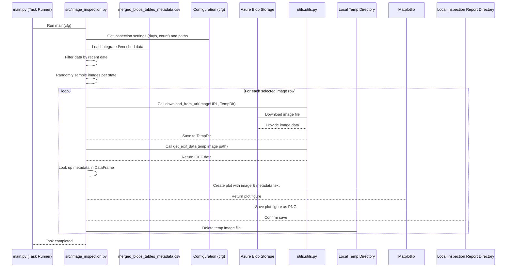

# Chapter 8: Image Inspection

Welcome back! In our previous chapter, [Chapter 7: Batch Generation](07_batch_generation_.md), we learned how to select specific sets of images based on our processed metadata and prepare them by copying the actual image files to a dedicated location. This is super useful for organizing data for downstream tasks.

One very important downstream task, especially in projects dealing with real-world data like field images, is ensuring the *quality* of the data. Are the images clear? Do they match the metadata? Is the camera information correct? This is where **Image Inspection** comes in.

### What is Image Inspection?

Imagine you have received a large delivery of goods. Before you accept the whole shipment, you might randomly open a few boxes, pull out an item, and check it carefully against its description on the packing slip. You want to do a quick "spot-check" to catch any obvious problems early.

**Image Inspection** in our project is exactly like this spot-check, but for image data. It's a specific task focused on **quality control**. It involves:

1.  **Selecting:** Picking a small, random number of images, usually from the most recently uploaded ones.
2.  **Gathering Details:** Finding the key information associated with those selected images (like when it was captured, where, what species metadata it has, important camera settings like exposure). This comes from our main processed dataset (`merged_blobs_tables_metadata.csv`) and potentially directly from the image file itself (EXIF data).
3.  **Displaying:** Showing the image visually alongside all its collected details in a clear way.
4.  **Reviewing:** Saving these combined image-and-details outputs so a human can easily look at them to quickly spot issues (e.g., blurry image, incorrect date, wrong species label).

**The Central Use Case:** The primary goal of this step is to quickly and efficiently review a small sample of the newest data to identify potential quality issues. For example, you might want to check if the last week's uploads have blurry images, or if the camera settings seem wildly off, or if the automated metadata extraction seems to be mislabeling certain species based on visual inspection.

### Why do we need this?

*   **Early Problem Detection:** Catching data quality issues shortly after upload prevents problems from propagating through the rest of the pipeline (processing, reporting, ML training).
*   **Targeted Improvement:** Spotting patterns in errors (e.g., all images from a specific camera type or date range have issues) helps focus efforts on fixing the root cause.
*   **Confidence:** Regular inspection builds confidence in the overall dataset quality.
*   **Verification:** Visually confirming that the processed metadata aligns with the actual image content.

### Key Concepts

*   **Spot-Checking:** Looking at a representative subset, not everything.
*   **Recent Data:** Focusing on the most vulnerable part of the data flow – the newest uploads.
*   **Metadata Combination:** Bringing together information from our main dataset (`merged_blobs_tables_metadata.csv`) and image-specific data (like EXIF).
*   **Temporary Download:** The project only downloads the small sample of images needed for the spot-check, it doesn't keep them permanently. This is efficient.
*   **Visual Output:** Creating image files (e.g., PNGs) that combine the visual image with text metadata, saved to a report directory for easy human review.

### How to Use Image Inspection

You control whether the Image Inspection task runs (and how many images it checks) through the project's configuration in `conf/config.yaml`.

The task name for this process is `image_inspection`.

Since this task needs the integrated and enriched metadata (specifically the `UploadDateTimeUTC` for filtering and other metadata for display), it must run *after* the data acquisition, integration, and enrichment steps ([Chapter 3](03_azure_data_acquisition_.md), [Chapter 4](04_data_integration___preprocessing_.md), [Chapter 5](05_datetime_metadata_enrichment_.md)). It can run alongside or after batch generation, as it uses the main metadata CSV, not necessarily the generated batches from Chapter 7.

You can also configure *how many recent days* to consider images from and *how many random images* to select from that pool using settings in the `inspection` section of `conf/config.yaml`.

Here's an example of how your `conf/config.yaml` might look to include Image Inspection and configure its behavior:

```yaml
# conf/config.yaml (Snippet showing Image Inspection task and settings)

# ... acquisition, integration, enrichment, reporting tasks from previous chapters ...
pipeline:
    - wir_table_generator
    - wir_blob_data_generator
    - process_blob_analysis
    - process_tables_analysis
    - append_datetime
    - report
    - plot_by_season
    - image_inspection        # Add this task to the pipeline

# ... other sections ...

inspection:
  num_past_days_to_inspect: 7  # Look at images uploaded in the last 7 days
  num_past_days_for_report: 7 # (This setting is used by the 'report' task, mentioned for context)
  num_images_to_inspect: 15    # Select up to 15 random images from those recent days
```

When you run `python main.py` with this configuration, the [Pipeline Task Runner](02_pipeline_task_runner_.md) will execute `image_inspection` after the other tasks. The code for `image_inspection` will then read the latest `merged_blobs_tables_metadata.csv`, identify images uploaded within the last `num_past_days_to_inspect`, randomly select `num_images_to_inspect` from that group (or fewer if not enough recent images exist), temporarily download those selected image files from Azure, read their EXIF data, combine it with metadata from the CSV, generate plots showing each image alongside its details, and save these plots to a report directory specified in `cfg.paths`.

The output will be a set of image files (e.g., PNGs) saved in a specific folder (like `report/inspect/US_...`) on your local machine, each displaying a sample image and its key metadata for easy visual review.

### How It Works Under the Hood

The `image_inspection` task is implemented in `src/image_inspection.py`. When the [Pipeline Task Runner](02_pipeline_task_runner_.md) calls its `main` function, here's the simplified process:

1.  **Load Data and Config:** The script loads the latest `merged_blobs_tables_metadata.csv` file (which contains all the integrated and enriched information) and gets the inspection settings (`num_past_days_to_inspect`, `num_images_to_inspect`) and output directory paths from the `cfg` object.
2.  **Identify Recent Images:** It filters the loaded dataset to find images where the `UploadDateTimeUTC` falls within the specified number of past days from today.
3.  **Select Random Sample:** From this list of recent images, it randomly selects a specified number of rows (images) to inspect. It selects from each state that uploaded data in the last few days.
4.  **Download Selected Images:** For each selected image, it uses the `ImageURL` from the dataset and a helper function (`download_from_url` from `utils.utils`) to temporarily download the actual image file from Azure Blob Storage to a local temporary directory.
5.  **Process and Plot:** It then iterates through the temporarily downloaded image files. For each image:
    *   It reads the EXIF data using a helper function (`get_exif_data` from `utils.utils`).
    *   It looks up the corresponding row in the original DataFrame (using the filename) to get other relevant metadata (State, Species, Upload time, etc.).
    *   It combines the EXIF data and DataFrame metadata into a single set of key details.
    *   It uses plotting libraries (like `matplotlib`) to create a figure showing the image on one side and the compiled metadata as text on the other side.
    *   It saves this figure as an image file (e.g., PNG) in the designated inspection report directory, often within a state-specific subfolder for organization.
    *   It cleans up the temporary downloaded image file.
6.  **Cleanup:** After processing all selected images, the temporary download directory is empty again.

Here's a simplified sequence diagram:



Let's look at simplified snippets from the code in `src/image_inspection.py`.

#### The Main Logic (`src/image_inspection.py`)

The `main` function orchestrates the steps:

```python
# src/image_inspection.py (Simplified main function)
import logging
from omegaconf import DictConfig
# ... other imports ...

log = logging.getLogger(__name__)

def main(cfg: DictConfig) -> None:
    """Main function to execute image inspection tasks."""
    log.info(f"Starting {cfg.general.task}") # Log the task name

    # Create an instance of the inspector, passing the config
    imginspect = InsepctRecentUploads(cfg)

    # Step 1: Download temporary images based on config settings
    imginspect.download_images_temp()

    # Step 2: Plot downloaded images with their metadata and save
    imginspect.plotting_sample_images_and_exif()

    log.info(f"{cfg.general.task} completed.")

# If you run this file directly (not via main.py), it will execute main()
if __name__ == "__main__":
    # Placeholder for direct execution logic (Hydra not initialized here)
    # In a real scenario, you might load config here or use a dummy config
    pass
```

**Explanation:**

*   The `main(cfg)` function is the entry point called by the [Pipeline Task Runner](02_pipeline_task_runner_.md). It receives the full `cfg` object.
*   It creates an `InsepctRecentUploads` object, passing `cfg`. The `__init__` method of this class (not shown here for brevity, but it loads the data and configures directories similar to other tasks) sets everything up.
*   It calls `imginspect.download_images_temp()` to handle selecting images based on date and random sampling, and then downloading them temporarily.
*   It then calls `imginspect.plotting_sample_images_and_exif()` to handle reading EXIF, getting other metadata, creating the visual plots, saving them, and cleaning up the temporary files.

#### Selecting and Downloading Images (`InsepctRecentUploads` in `src/image_inspection.py`)

This method selects the images to inspect and downloads them:

```python
# src/image_inspection.py (Simplified download_images_temp method)
import os
import logging
import pandas as pd
from datetime import datetime, timedelta
from pathlib import Path
# ... other imports ...
from utils.utils import find_most_recent_data_csv, download_from_url # Helper functions

log = logging.getLogger(__name__)

class InsepctRecentUploads:
    # ... (__init__ method is here, reading cfg, csv, setting paths) ...
    def __init__(self, cfg) -> None:
        # Load configuration, input CSV, and keys
        self.cfg = cfg
        # Find the most recent merged_blobs_tables_metadata.csv
        self.csv_path = find_most_recent_data_csv(cfg.paths.datadir) # Find the CSV
        self.df = self.read() # Read the CSV into a pandas DataFrame
        self.config_inspection_dir() # Set up output directories
        # Get settings from config
        self.temp_image_dir = Path(cfg.paths.temp_image_dir)
        self.temp_image_dir.mkdir(exist_ok=True, parents=True) # Ensure temp dir exists
        self.num_past_days_to_inspect = cfg.inspection.num_past_days_to_inspect
        self.num_images_to_inspect = cfg.inspection.num_images_to_inspect

    def read(self) -> pd.DataFrame:
         # ... (method to read the CSV using self.csv_path and return DataFrame) ...
         log.info(f"Reading path: {self.csv_path}")
         df = pd.read_csv(self.csv_path, low_memory=False)
         # Ensure UploadDateTimeUTC is datetime object
         df["UploadDateTimeUTC"] = pd.to_datetime(df["UploadDateTimeUTC"], errors='coerce')
         return df

    def config_inspection_dir(self) -> None:
         # ... (method to create report and inspect directories from cfg.paths) ...
         log.info(f"Creating output path for the results")
         self.report_dir = Path(self.cfg.paths.missing_batch_folders).parent
         self.report_dir.mkdir(exist_ok=True, parents=True) # Example output dir
         self.inspect_dir = Path(self.cfg.paths.inspectdir) # Specific inspection plot dir
         self.inspect_dir.mkdir(exist_ok=True, parents=True)


    def download_images_temp(self) -> None:
        """Download a selected random sample of recent images per state."""
        log.info(f"Attempting to download random photos from last {self.num_past_days_to_inspect} days...")

        # Calculate the date threshold based on config setting
        current_date = pd.to_datetime(datetime.now().date())
        targeted_days_ago = current_date - timedelta(self.num_past_days_to_inspect)

        # Filter the DataFrame for images uploaded within the date range
        df_targeted_days = self.df[
            (self.df['UploadDateTimeUTC'].dt.date >= targeted_days_ago.date())
            & (self.df['UploadDateTimeUTC'].dt.date <= current_date.date())
        ].copy() # Work on a copy

        if df_targeted_days.empty:
            log.info(f"No uploads found in the last {self.num_past_days_to_inspect} days to inspect.")
            return # Stop if no recent images

        # Get list of unique states with recent uploads
        unique_states = df_targeted_days["UsState"].dropna().unique()

        log.info(f"Temporary downloading random photos to {self.temp_image_dir}")

        # Loop through each state with recent uploads
        for state in unique_states:
            # Filter data for the current state and keep only JPGs (often easier to read EXIF)
            state_jpg_df = df_targeted_days[
                (df_targeted_days["UsState"] == state) & (df_targeted_days['ImageURL'].str.lower().str.endswith('.jpg'))
            ]

            if state_jpg_df.empty:
                log.info(f"No recent .JPG images found for state: {state}")
                continue # Skip to next state if no JPGs

            # Determine how many images to select for this state (up to the configured number)
            num_images = min(len(state_jpg_df), self.num_images_to_inspect)
            log.info(f"Selecting {num_images} images for state: {state}")

            # Randomly sample image URLs
            random_imageurls = state_jpg_df['ImageURL'].sample(n=num_images, replace=False).tolist() # Use replace=False

            # Download each selected image
            for url in random_imageurls:
                try:
                    # Use the helper function to download the image to the temp directory
                    download_from_url(url, self.cfg.paths.temp_image_dir)
                except Exception as e:
                    log.error(f"Failed to download image from {url}: {e}")

```

**Explanation:**

*   The `__init__` method loads the main CSV, sets up output directories, and reads the `num_past_days_to_inspect` and `num_images_to_inspect` settings from the `cfg` object. It also creates the local temporary directory (`self.temp_image_dir`) where selected images will be downloaded.
*   The `read` and `config_inspection_dir` methods are standard setup found in many task classes. `read` specifically ensures the `UploadDateTimeUTC` is a proper datetime column.
*   `download_images_temp` is where the selection happens. It filters the DataFrame based on the upload date being within the last `num_past_days_to_inspect` days. It then loops through each state present in this filtered data. For each state, it filters for JPG images (as EXIF is commonly in JPGs), randomly samples up to `self.num_images_to_inspect` URLs, and calls the `download_from_url` helper function (from `utils.utils`) for each URL to save the file in the temporary directory.

#### Plotting and Saving Results (`InsepctRecentUploads` in `src/image_inspection.py`)

This method processes the temporarily downloaded images, extracts EXIF and metadata, creates the plots, and saves them:

```python
# src/image_inspection.py (Simplified plotting_sample_images_and_exif method)
import os
import logging
import shutil # For removing directories
from pathlib import Path
# ... other imports ...
from PIL import Image # To open image files
import matplotlib.pyplot as plt # For plotting
# import seaborn as sns # Not strictly needed for just displaying image+text
from omegaconf import DictConfig
from utils.utils import get_exif_data # Helper to read EXIF

log = logging.getLogger(__name__)

class InsepctRecentUploads:
    # ... (__init__, read, config_inspection_dir, download_images_temp methods are here) ...

    def plotting_sample_images_and_exif(self) -> None:
        """ Plots sample images along with important EXIF information and other metadata."""
        log.info(f"Plotting images with metadata for inspection.")

        # Clean up previous inspection outputs in the inspect directory
        try:
            # The original code removes directories - ensure it's just files if needed
            # shutil.rmtree(os.path.join(self.inspect_dir, folder_name)) for folder_name in os.listdir(self.inspect_dir)]
            # Simpler: remove all files in the inspect directory before saving new ones
            for item in Path(self.inspect_dir).iterdir():
                if item.is_file():
                    item.unlink() # Delete the file
        except OSError as e:
            log.error(f"Error while cleaning inspection directory: {e}")


        temp_image_dir = Path(self.cfg.paths.temp_image_dir) # Get the path to the temp directory

        # Iterate through images that were just downloaded to the temp directory
        for image_path_obj in temp_image_dir.iterdir(): # Iterate through Path objects
            image_path = str(image_path_obj) # Convert Path object to string path
            filename = image_path_obj.name # Get just the filename
            
            # Filter for relevant file extensions
            if not filename.lower().endswith(('.jpg', '.jpeg', '.png')):
                 log.debug(f"Skipping non-image file in temp dir: {filename}")
                 continue # Skip if not an image

            try:
                # 1. Read EXIF data using the helper function
                exif_info = get_exif_data(image_path)

                # Select specific EXIF tags of interest
                selected_exif_tags = ['Image DateTime', 'EXIF ExposureTime', 'EXIF ISOSpeedRatings', 'EXIF FNumber', 'EXIF FocalLength']
                selected_exif = {tag: value for tag, value in exif_info.items() if tag in selected_exif_tags}

                # 2. Look up other metadata for this image in the main DataFrame
                # Use .loc to find the row where 'Name' matches the current filename
                # .iloc[0] assumes we find at least one match and take the first one
                image_metadata = self.df.loc[self.df['Name'] == filename]
                if image_metadata.empty:
                     log.warning(f"Metadata not found in CSV for downloaded image: {filename}. Skipping plotting.")
                     os.remove(image_path) # Clean up temp image
                     continue

                # Extract specific columns from the DataFrame row
                selected_metadata = {
                    'UsState': image_metadata['UsState'].iloc[0],
                    'Username': image_metadata['Username'].iloc[0],
                    'Species': image_metadata['Species'].iloc[0],
                    'UploadDateTimeUTC': image_metadata['UploadDateTimeUTC'].iloc[0],
                    'HasMatchingJpgAndRaw': image_metadata['HasMatchingJpgAndRaw'].iloc[0],
                    # Add any other relevant columns here
                }

                # Combine EXIF and other metadata for display
                all_info_for_display = {**selected_metadata, **selected_exif} # Merge dictionaries

                # 3. Plot the image with the combined information
                image = Image.open(image_path) # Open the image file

                # Create a figure with two subplots: one for the image, one for text
                fig, (ax_image, ax_info) = plt.subplots(1, 2, figsize=(10, 5)) # Adjust figsize as needed

                # Display the image in the first subplot
                ax_image.imshow(image)
                ax_image.axis('off') # Hide axes ticks
                ax_image.set_title(f'Inspection: {filename}') # Set title

                # Prepare the metadata text for the second subplot
                info_text = '\n'.join([f"{tag}: {value}" for tag, value in all_info_for_display.items()])
                ax_info.text(0, 1, info_text, fontsize=9, color='black', verticalalignment='top', wrap=True) # Display text
                ax_info.axis('off') # Hide axes ticks

                fig.tight_layout() # Adjust layout to prevent overlap

                # 4. Save the plot
                # Use state to organize output files
                state = selected_metadata.get('UsState', 'UnknownState') # Handle missing state
                # Create state specific sub-directory within the inspect dir
                state_folder = Path(self.inspect_dir, state)
                state_folder.mkdir(exist_ok=True, parents=True)
                # Define the save path using the state folder and original filename
                save_path = Path(state_folder, f"{Path(filename).stem}_inspection.png") # Save as PNG

                plt.savefig(save_path, dpi=200) # Save the figure as a PNG image
                plt.close(fig) # Close the figure to free memory

                # 5. Clean up the temporary downloaded image file
                os.remove(image_path)
                log.debug(f"Processed and removed temporary image: {filename}")

            except Exception as e:
                log.error(f"Error processing or plotting image {filename} for inspection: {e}")
                # Try to clean up the temp file even on error
                if os.path.exists(image_path):
                    os.remove(image_path)


```

**Explanation:**

*   `plotting_sample_images_and_exif` starts by cleaning the output `inspect_dir` to ensure previous inspection results don't clutter the new ones.
*   It then loops through the files that were downloaded to the temporary directory (`self.temp_image_dir`) by `download_images_temp`.
*   Inside the loop, for each image file:
    *   It calls `get_exif_data` (a helper from `utils.utils`) to read the EXIF data from the temporary file and extracts specific tags like `Image DateTime`, exposure settings, etc.
    *   It uses `self.df.loc[self.df['Name'] == filename]` to find the row in the main metadata DataFrame that corresponds to the current image file. It then extracts specific columns (State, Species, Username, etc.) from this row.
    *   It combines the extracted EXIF tags and DataFrame metadata into a single dictionary.
    *   It uses `matplotlib.pyplot` (`plt`) and `PIL.Image` to open the image and create a figure with two panels (`ax_image`, `ax_info`).
    *   The image is displayed in `ax_image` using `ax_image.imshow()`.
    *   The combined metadata is formatted into a string and displayed as text in `ax_info` using `ax_info.text()`.
    *   It creates a state-specific subfolder within the main `inspect_dir`.
    *   `plt.savefig()` saves the entire figure (image + metadata) as a PNG file in the state subfolder.
    *   `plt.close(fig)` is important to free up memory after plotting each figure.
    *   `os.remove(image_path)` deletes the temporary image file that was downloaded.
*   Error handling is included to log issues and attempt to clean up temporary files even if plotting fails for a specific image.

#### Utility Functions Used (`utils/utils.py`)

The plotting method relies on helper functions, notably:

```python
# utils/utils.py (Relevant Snippets for Image Inspection)
import exifread # Library to read EXIF data
import requests # For downloading files from URL
import os # For removing files
from pathlib import Path # For path manipulation
# ... other imports ...

def get_exif_data(image_path: str) -> dict:
    """Extracts EXIF data from an image file and returns it as a dictionary."""
    # Opens the image file, uses the exifread library to parse it,
    # and returns a dictionary of EXIF tags and their values.
    # Handles potential errors and filters out large/unnecessary tags.
    # (See Chapter 5 for a more detailed explanation)
    try:
        with open(image_path, "rb") as f:
            tags = exifread.process_file(f)
        if tags:
             # Return a dictionary of key EXIF tags
             # (Actual implementation filters more tags)
             return {k: str(v) for k, v in tags.items() if k not in ["JPEGThumbnail", "TIFFThumbnail", "Filename", "EXIF MakerNote"]}
        return {}
    except Exception:
        # Handle errors during EXIF reading
        return {}


def download_from_url(image_url: str, savedir: str = ".") -> None:
    """Downloads an image from a URL and saves it to the specified directory."""
    # Creates the save directory if it doesn't exist.
    # Extracts filename from URL.
    # Uses 'requests' library to download the file content.
    # Saves the content to a local file.
    # (See Chapter 5 for a slightly different download method using azcopy)
    log.debug(f"Downloading {image_url} to {savedir}")
    try:
        if not Path(savedir).exists():
            Path(savedir).mkdir(exist_ok=True, parents=True)
        fname = Path(image_url).name
        fpath = Path(savedir, fname)
        response = requests.get(image_url, stream=True) # Use stream=True for potentially large files

        if response.status_code == 200:
            with open(fpath, "wb") as file:
                 # Write content in chunks
                for chunk in response.iter_content(chunk_size=8192):
                    file.write(chunk)
            log.debug(f"Downloaded {fname}")
        else:
            log.error(f"Failed to download image from {image_url}: Status {response.status_code}")
    except Exception as e:
        log.error(f"Exception during download from {image_url}: {e}")


# find_most_recent_data_csv is also used (see Chapter 5)
# It helps locate the most recent merged_blobs_tables_metadata.csv file.

```

**Explanation:**

*   `get_exif_data`: Reads the binary content of an image file and uses the `exifread` library to parse the embedded EXIF tags, returning them as a dictionary.
*   `download_from_url`: Takes an image URL (like the `ImageURL` from our dataset, which includes the SAS token needed for access), downloads the file content from that URL using the `requests` library, and saves it to a specified local directory. This is used to get the actual image file data from Azure temporarily.
*   `find_most_recent_data_csv`: This helper function (explained in [Chapter 5](05_datetime_metadata_enrichment_.md)) is used in the `__init__` method to make sure the inspector loads the most recently generated `merged_blobs_tables_metadata.csv`.

By using these steps and helpers, the Image Inspection task efficiently selects a small sample of recent images, pulls relevant metadata from the main dataset and the image file itself, and creates easy-to-review plots showing the image and its details.

After the `image_inspection` task runs, you will find a set of PNG image files organized into state subfolders (e.g., `report/inspect/US_IA/`) within your configured inspection directory (`cfg.paths.inspectdir`). Each PNG file will display one sample image next to its key metadata, ready for manual quality review.

### Summary

In this chapter, we explored **Image Inspection**. We learned that this is a critical quality control step where a small, random sample of recent images is selected, downloaded temporarily, and displayed alongside their key metadata (from the main dataset and EXIF) in generated plots for manual review.

We saw that this process is triggered by including the `image_inspection` task in the `pipeline` list in `conf/config.yaml`, and its behavior (how many recent days to look at, how many images to sample) is controlled by settings in the `inspection` section of the config.

Under the hood, the `image_inspection` task (implemented in `src/image_inspection.py`) loads the main dataset, filters and samples recent images, uses helper functions (`download_from_url`, `get_exif_data` from `utils.utils.py`) to temporarily download images and read their EXIF data, combines this with metadata from the DataFrame, uses `matplotlib` to generate visual plots showing the image and details side-by-side, saves these plots to the configured inspection directory, and cleans up the temporary image files.

We've now covered how the project acquires data, processes it, enriches it, reports on it, batches it, and allows for visual inspection. Throughout these chapters, we've seen references to helper functions in `utils/utils.py`.

Let's move on to the final chapter where we'll take a closer look at these common **Utility Functions** and Azure Authentication Keys.

[Utility Functions](09_utility_functions_.md)

---

Generated by [AI Codebase Knowledge Builder](https://github.com/The-Pocket/Tutorial-Codebase-Knowledge)