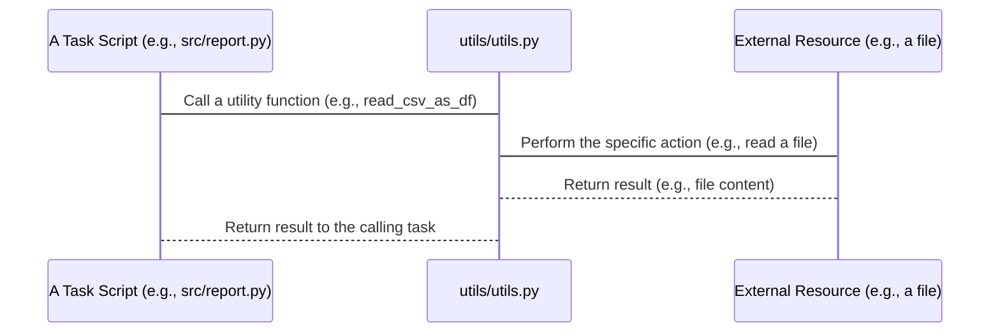

# Chapter 9: Utility Functions

Welcome back! We've now explored many different parts of the `Field-DataExploration` project pipeline. In [Chapter 8: Image Inspection](08_image_inspection_.md), for example, we saw how the project selects recent images, downloads them temporarily, reads their hidden EXIF data, and combines it with metadata from the main dataset to create helpful visual reports.

As we've gone through these steps – from acquiring data, processing it, enriching it, generating reports, batching, and inspecting – you might have noticed that certain actions or helper pieces of code seem to pop up in different places. Things like reading a configuration file, loading a CSV into a usable format, interacting with external tools, or performing small data transformations.

Writing the exact same code for these common tasks inside *every* single task script (`src/report.py`, `src/append_datetime.py`, `src/create_batches.py`, etc.) would be repetitive and messy. If you needed to fix a bug in how CSVs are read, you'd have to find and change the code in many different files!

### What are Utility Functions?

Imagine you have a workshop where different people are building different things. Instead of each person having their *own* set of hammers, screwdrivers, and rulers, it makes more sense to have a **shared toolbox** in the corner. Anyone who needs a hammer or a ruler can go to the shared toolbox and grab the right tool.

**Utility Functions** in programming are exactly like this shared toolbox. They are a collection of small, reusable pieces of code (functions) that perform common, general-purpose tasks needed by various parts of the project. They aren't tied to one specific job (like 'reporting' or 'batching') but provide tools that *those jobs* can use.

**The Central Use Case:** The main benefit is having a single place for general helper tasks. If multiple parts of the project need to read a YAML file, the code to do that lives in one place (the "utility toolbox"). When another part needs to read hidden data from an image file (EXIF), that tool is also in the same shared place. This makes the project cleaner, easier to maintain, and prevents code duplication.

In the `Field-DataExploration` project, these utility functions primarily live in the file `utils/utils.py`.

### Key Concepts

*   **Shared Code:** Code that is useful in more than one place in the project.
*   **Reusability:** Writing a function once and calling it whenever needed.
*   **Simplification:** Hiding complex details (like *how* to read a YAML file or *how* to run an external command) inside a simple function call. The part of the code that *uses* the utility doesn't need to know the details, just what the utility *does*.
*   **Centralized Location:** Keeping these helper functions together in a dedicated file (`utils/utils.py`) makes them easy to find and manage.

### How to Use Utility Functions

As a user running the project via `main.py` and configuring it via `conf/config.yaml`, you actually don't interact directly with the utility functions yourself.

Instead, the *tasks* that you choose to run in your `pipeline` (like `report`, `append_datetime`, `create_batches`, etc., which we discussed in previous chapters) are the ones that *use* the utility functions internally.

For example, when you configure the pipeline to include `append_datetime` ([Chapter 5: Datetime Metadata Enrichment](05_datetime_metadata_enrichment_.md)), the code inside `src/append_datetime.py` knows it needs to read the Azure keys file. It doesn't have the code to read YAML itself; instead, it calls the `read_yaml` utility function from `utils/utils.py`. Similarly, when it needs to download an image to read EXIF, it calls the `download_from_url` or `download_azcopy` utility function.

Here's a simple example from `src/append_datetime.py` showing how it uses a utility function:

```python
# Snippet from src/append_datetime.py
# ... other imports ...
from utils.utils import read_yaml # Import the utility function

class EXIFMetadataManager:
    def __init__(self, cfg: DictConfig):
        # ... other setup ...
        # Use the utility function to read the keys file
        self.keys = read_yaml(cfg.pipeline_keys)
        # ... rest of init ...

# ... rest of the file ...
```

In this snippet, the code in `append_datetime.py` doesn't contain the logic for opening and parsing a YAML file. It simply `import`s the `read_yaml` function from `utils.utils` and then calls `read_yaml(cfg.pipeline_keys)`. The `read_yaml` function handles the details and returns the data, which is then stored in `self.keys`.

This is how you "use" utility functions: you call them from other parts of your code when you need to perform a common helper task.

### How It Works Under the Hood

When a task script needs to perform a common action, it simply calls the appropriate function in `utils/utils.py`.

Here's a simple sequence:



The task script doesn't need to know *how* `utils/utils.py` reads the file; it just trusts that calling `read_csv_as_df` will give it a pandas DataFrame if the file exists.

Let's look at a few simplified examples of utility functions found in `utils/utils.py` that are used throughout the project.

#### Reading Configuration or Keys (`read_yaml`)

Many parts of the project need to read configuration files or the Azure keys file, which are in YAML format. The `read_yaml` function handles this.

```python
# Simplified snippet from utils/utils.py
import yaml # Library to work with YAML

def read_yaml(path: str) -> dict:
    """Reads a YAML file and returns its content as a dictionary."""
    try:
        with open(path, "r") as file:
            data = yaml.safe_load(file) # Use the yaml library to load
        return data # Return the data as a Python dictionary
    except Exception as e:
        # Handle errors, like the file not existing
        raise FileNotFoundError(f"File does not exist : {path}")

```

**Explanation:**

*   This function takes a `path` (a string indicating the file location).
*   It uses Python's built-in file handling (`open`) and the `yaml` library to safely read the content of the file.
*   `yaml.safe_load()` parses the YAML content into a Python dictionary.
*   It returns this dictionary.
*   It includes basic error handling if the file isn't found.

Any task needing to read a YAML file just calls `read_yaml("path/to/your/file.yaml")`.

#### Reading Data Files (`read_csv_as_df`)

Similarly, most tasks that work with the project's data need to read CSV files into a pandas DataFrame ([Chapter 4: Data Integration & Preprocessing](04_data_integration___preprocessing_.md)). The `read_csv_as_df` function does this.

```python
# Simplified snippet from utils/utils.py
import pandas as pd # The data processing library

def read_csv_as_df(path: str) -> pd.DataFrame:
    """Reads a CSV file into a pandas DataFrame."""
    try:
        # Use pandas to read the CSV, low_memory=False helps with large files
        csv_reader = pd.read_csv(path, low_memory=False)
        return csv_reader # Return the data as a pandas DataFrame
    except Exception as e:
        # Handle errors if the file doesn't exist or is unreadable
        raise FileNotFoundError(f"File does not exist : {path}")

```

**Explanation:**

*   This function takes a `path` to a CSV file.
*   It uses the `pandas` library (`pd.read_csv`) to read the file and load its contents into a DataFrame.
*   It returns the resulting DataFrame.
*   Basic error handling is included.

Any task needing to read a CSV file simply calls `read_csv_as_df("path/to/your/data.csv")`.

#### Extracting Image Metadata (`get_exif_data`)

As seen in [Chapter 5: Datetime Metadata Enrichment](05_datetime_metadata_enrichment_.md) and [Chapter 8: Image Inspection](08_image_inspection_.md), reading EXIF data from image files is a specific task needed by multiple parts.

```python
# Simplified snippet from utils/utils.py
import exifread # Library to read EXIF data

def get_exif_data(image_path: str) -> dict:
    """Extracts EXIF data from an image file and returns it as a dictionary."""
    try:
        with open(image_path, "rb") as f: # Open the image file in binary mode
            tags = exifread.process_file(f) # Use exifread to parse
        if tags:
            exif = {}
            for k, v in tags.items():
                 # Filter out large/unnecessary tags and convert values to string
                 if k not in ("JPEGThumbnail", "TIFFThumbnail"):
                      exif[k] = str(v) # Store tag name and string value
            return exif # Return dictionary of EXIF tags
        else:
            return {} # Return empty if no EXIF found
    except Exception:
        # Handle errors during reading
        return {}

```

**Explanation:**

*   This function takes the `image_path` to a local image file.
*   It uses Python's file handling to open the image in binary mode (`"rb"`).
*   It uses the `exifread` library to parse the file and extract the EXIF tags.
*   It processes the extracted tags into a cleaner dictionary format, filtering out some large tags like thumbnails.
*   It returns the dictionary containing the EXIF information.

Tasks like `append_datetime` or `image_inspection` call `get_exif_data("temp/downloaded_image.jpg")` when they need to read the timestamp or other camera details directly from an image file.

#### Interacting with Azure/External URLs (`download_from_url` / `azcopy` helpers)

Several tasks need to download files from Azure Blob Storage or other URLs. Utility functions handle the specifics of making these external calls. We saw `download_from_url` in [Chapter 8: Image Inspection](08_image_inspection_.md) (using `requests`) and `azcopy` functions in [Chapter 5: Datetime Metadata Enrichment](05_datetime_metadata_enrichment_.md) and [Chapter 7: Batch Generation](07_batch_generation_.md) (using `subprocess`).

```python
# Simplified snippet from utils/utils.py
import requests # Library to make web requests
from pathlib import Path # For handling file paths

def download_from_url(image_url: str, savedir: str = ".") -> None:
    """Downloads an image from a URL and saves it to the specified directory."""
    try:
        if not Path(savedir).exists():
            Path(savedir).mkdir(exist_ok=True, parents=True) # Create save directory if needed
        fname = Path(image_url).name # Get filename from the URL
        fpath = Path(savedir, fname) # Construct the local save path
        response = requests.get(image_url) # Make the HTTP request

        if response.status_code == 200: # Check if download was successful
            with open(fpath, "wb") as file:
                file.write(response.content) # Save the content to a file
        else:
            # Handle download failure
            print(f"Failed to download image from {image_url}: Status {response.status_code}")
    except Exception as e:
        # Handle other errors
        print(f"Exception during download from {image_url}: {e}")

# --- Another example using subprocess for azcopy ---
import subprocess # To run external commands

def download_azcopy(azuresrc: str, localdest: str):
    """Downloads a single file from Azure Blob Storage using the azcopy command-line tool."""
    # Construct the azcopy command string
    command = f'azcopy cp "{azuresrc}" "{localdest}"'

    # Run the command using subprocess
    result = subprocess.run(command, shell=True, capture_output=True, text=True)

    # Check the command's exit code
    if result.returncode == 0:
        print("Azcopy download successful")
    else:
        print("Error in azcopy download")
        print(result.stderr) # Print error message from azcopy

```

**Explanation:**

*   `download_from_url`: Uses the `requests` library to send an HTTP GET request to the given `image_url`, which might include a SAS token for Azure access. It reads the response content and saves it to a local file.
*   `download_azcopy`: Builds a command string for the external `azcopy` tool, specifying the source Azure URL and the local destination. It then uses Python's `subprocess.run` to execute this command just as if you typed it in a terminal. It checks the `result.returncode` to know if `azcopy` succeeded.

These utilities abstract away the complexities of making network requests or running external programs, providing simple function calls for tasks that need to get files.

These are just a few examples; `utils/utils.py` contains other helpers like `find_most_recent_csv` (to locate the newest data file, used in Ch 5, 6, 7, 8), `normalize_datetime_column` (to clean up dates, used in Ch 5), or `round_down_to_nearest_3_hours` (for time-based grouping, used in Ch 7).

By keeping all these shared tools in one place, the main task scripts remain focused on their specific job (like generating a report or creating a batch) and rely on the utility functions for these common actions.

### Summary

In this chapter, we looked at **Utility Functions**. We learned that they act like a shared toolbox (`utils/utils.py`) containing reusable pieces of code for common tasks such as reading files (YAML, CSV), extracting data (EXIF), interacting with external tools (`azcopy`, `requests`), and other small data manipulations.

We saw that you don't typically configure or run these utilities directly. Instead, other tasks in the project pipeline (`report`, `append_datetime`, `create_batches`, `image_inspection`, etc.) import and call these utility functions whenever they need to perform a general helper action.

Under the hood, these utility functions use standard Python libraries (`yaml`, `pandas`, `exifread`, `requests`, `subprocess`) to perform their specific jobs, hiding the implementation details from the calling task scripts.

This separation of concerns makes the project's code cleaner, easier to understand, and simpler to maintain, as common logic is centralized.

We've seen throughout the chapters that accessing data and services in Azure often requires special keys or credentials. The `utils/utils.py` file includes the `read_yaml` function specifically to read the file containing these keys (`cfg.pipeline_keys`).

Let's move on to the final chapter where we'll specifically discuss **Azure Authentication Keys** and how they are managed and used.

[Azure Authentication Keys](10_azure_authentication_keys_.md)

---

Generated by [AI Codebase Knowledge Builder](https://github.com/The-Pocket/Tutorial-Codebase-Knowledge)